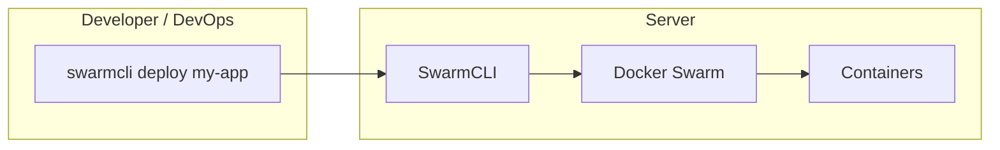
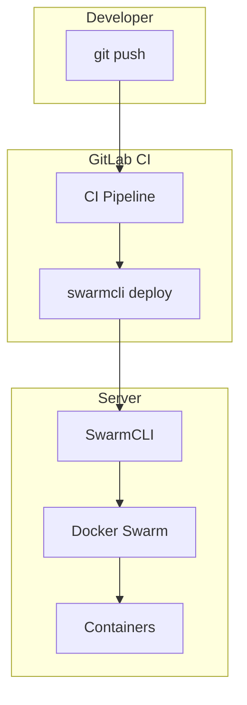

# SwarmCLI Overview

SwarmCLI is a CLI tool for CI/CD in Docker Swarm with a profile-based architecture.

## Why SwarmCLI?

### The Problem

When working with Docker Swarm, typical challenges arise:

- **Multiple servers** — dev, staging, production require different configurations
- **Manual deployment** — repetitive `docker stack deploy` commands
- **Secret management** — passwords and tokens need to be transferred securely
- **Change history** — rolling back to a previous version is not straightforward
- **GitLab CI integration** — lots of boilerplate code in `.gitlab-ci.yml`

### The Solution

SwarmCLI provides:

```
┌─────────────────────────────────────────────────────────────────┐
│                        SwarmCLI                                  │
├─────────────────────────────────────────────────────────────────┤
│  ✓ Server profiles    — isolated configurations                 │
│  ✓ Unified CLI        — deploy, rollback, logs in one command   │
│  ✓ Docker Secrets     — secure password management             │
│  ✓ Deploy history     — rollback in one command                │
│  ✓ GitLab CI templates — minimal .gitlab-ci.yml                 │
│  ✓ Retry logic        — resilience to network failures          │
│  ✓ JSON API           — for automation (n8n, scripts)           │
└─────────────────────────────────────────────────────────────────┘
```

## How Does It Work?

SwarmCLI supports two deployment modes:

| Mode | When to use | Trigger |
|------|-------------|---------|
| **Manual** | Small teams, dev/staging, quick iterations | `swarmcli deploy` on server or via SSH |
| **With CD** | Production, team workflows, audit trail | GitLab CI / GitHub Actions on push or manual button |

### Manual Deployment (without CD)

Developer or DevOps runs deploy directly on the server or via SSH:



```bash
# On server
swarmcli use server-dev
swarmcli deploy my-app

# Or via SSH from local machine
ssh deploy@server "cd /opt/swarmcli && swarmcli deploy my-app --branch main"
```

### Deployment with CD (GitLab CI)

Push triggers pipeline; deploy runs in CI or by manual button:



```yaml
# .github/workflows/deploy.yml
name: Deploy
on:
  push:
    branches: [main]
jobs:
  deploy:
    runs-on: ubuntu-latest
    steps:
      - uses: actions/checkout@v4
      - run: swarmcli deploy my-app --profile server-dev
```

### Profile Architecture

```
swarmcli/
├── profiles/
│   ├── server-dev/           # Development server
│   │   ├── config.yaml       # Profile settings
│   │   └── stacks/           # Application stacks
│   │       ├── my-app/
│   │       ├── backend/
│   │       └── frontend/
│   │
│   ├── server-prod/          # Production server
│   │   ├── config.yaml
│   │   └── stacks/
│   │
│   └── server-db/            # Database server
│       ├── config.yaml
│       └── stacks/
```

**One repository → multiple servers → full configuration isolation**

## Main Commands

```bash
# Set default profile
swarmcli use server-dev

# List stacks
swarmcli ls

# Status of all stacks
swarmcli ps

# Deploy
swarmcli deploy my-app

# Rollback
swarmcli rollback my-app

# Logs
swarmcli logs my-app --service api
```

## Typical Workflow

### Without CD (manual)

1. **Develop** — write code, commit, push
2. **Deploy** — SSH to server and run `swarmcli deploy my-app`
3. **Rollback** — if needed: `swarmcli rollback my-app`

### With CD (GitLab CI)

1. **Develop** — write code, commit, push to branch
2. **Pipeline** — CI runs tests, then deploy job (automatic or manual button)
3. **Deploy** — GitLab Runner executes `swarmcli deploy my-app --branch <branch>` on server
4. **Rollback** — if needed: `swarmcli rollback my-app` (from server or CI job)

## Who Is This Tool For?

| Role | Usage |
|------|-------|
| **DevOps** | Profile setup, CI/CD, secret management |
| **Backend** | Deploy own services, view logs |
| **Frontend** | Deploy, check status |
| **QA** | Deploy feature branches for testing |

## Next Steps

1. **[Requirements](01-requirements.md)** — what you need to get started
2. **[Installation](02-installation.md)** — how to install SwarmCLI
3. **[First Deploy](03-first-deploy.md)** — deploy in 5 minutes (manual mode)
4. **[CI/CD](../05-operations/gitlab-ci/00-overview.md)** — setup deployment with CD

---

## See Also

- [Glossary](../01-concepts/00-glossary.md) — terms and definitions
- [CLI Reference](../03-reference/cli/00-overview.md) — all commands
- [Architecture](../04-architecture/) — how SwarmCLI is built
