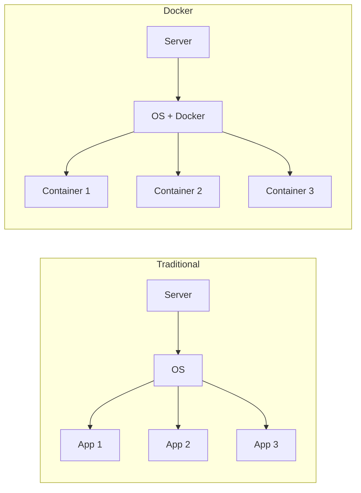

# Docker Basics

A brief introduction to Docker for beginners.

## What is Docker?

Docker is a platform for packaging and running applications in isolated containers.



### Benefits

- **Isolation** — applications don't interfere with each other
- **Reproducibility** — works the same everywhere
- **Portability** — one image for dev, staging, prod
- **Versioning** — easy rollback to previous version

## Core Concepts

### Image

An image is an immutable template for creating containers.

```
┌─────────────────────────────────┐
│           Image                 │
├─────────────────────────────────┤
│  Layer 4: Your code             │
│  Layer 3: npm install           │
│  Layer 2: Node.js              │
│  Layer 1: Ubuntu                │
└─────────────────────────────────┘
```

Images are built in layers. Each layer is cached.

### Container

A container is a running instance of an image.

```bash
# Run container from image
docker run -d -p 8080:80 nginx

# List running containers
docker ps

# Stop container
docker stop <container_id>
```

### Dockerfile

Dockerfile — instructions for building an image.

```dockerfile
# Base image
FROM node:18-alpine

# Working directory
WORKDIR /app

# Copy dependencies
COPY package*.json ./
RUN npm ci --only=production

# Copy code
COPY . .

# Port
EXPOSE 3000

# Start command
CMD ["node", "server.js"]
```

### Build and Run

```bash
# Build image
docker build -t my-app:1.0 .

# Run container
docker run -d -p 3000:3000 my-app:1.0

# View logs
docker logs <container_id>
```

## Essential Commands

### Images

```bash
# List images
docker images

# Pull image
docker pull nginx:alpine

# Remove image
docker rmi nginx:alpine

# Build image
docker build -t my-app .
```

### Containers

```bash
# List running
docker ps

# List all (including stopped)
docker ps -a

# Start
docker run -d nginx

# Stop
docker stop <id>

# Remove
docker rm <id>

# Logs
docker logs <id>

# Shell into container
docker exec -it <id> /bin/sh
```

### Cleanup

```bash
# Remove stopped containers
docker container prune

# Remove unused images
docker image prune

# Remove all unused
docker system prune
```

## Docker Compose

Docker Compose — tool for running multi-container applications.

### docker-compose.yml

```yaml
services:
  web:
    image: nginx:alpine
    ports:
      - "8080:80"
    depends_on:
      - api
  
  api:
    build: ./api
    environment:
      - DATABASE_URL=postgres://db:5432
    depends_on:
      - db
  
  db:
    image: postgres:15
    volumes:
      - pgdata:/var/lib/postgresql/data
    environment:
      - POSTGRES_PASSWORD=secret

volumes:
  pgdata:
```

### Compose Commands

```bash
# Start
docker-compose up -d

# Stop
docker-compose down

# Logs
docker-compose logs -f

# Rebuild
docker-compose up -d --build
```

## Networks

Containers can communicate through virtual networks.

```yaml
services:
  web:
    networks:
      - frontend
      - backend
  
  api:
    networks:
      - backend
  
  db:
    networks:
      - backend

networks:
  frontend:
  backend:
```

Containers on the same network "see" each other by service name:

```bash
# From web container:
curl http://api:3000  # api — service name
```

## Volumes

Volumes — persistent storage for data.

```yaml
services:
  db:
    image: postgres:15
    volumes:
      # Named volume
      - pgdata:/var/lib/postgresql/data
      # Bind mount (local folder)
      - ./init:/docker-entrypoint-initdb.d

volumes:
  pgdata:
```

## Environment Variables

```yaml
services:
  api:
    environment:
      - NODE_ENV=production
      - DATABASE_URL=postgres://db:5432
    env_file:
      - .env
```

```bash
# .env
API_KEY=secret123
DEBUG=false
```

## Relation to SwarmCLI

SwarmCLI uses all these Docker concepts:

| Docker | SwarmCLI |
|--------|----------|
| `docker build` | `swarmcli build` |
| `docker-compose.yml` | `docker-stack.yml` |
| `docker stack deploy` | `swarmcli deploy` |
| `docker logs` | `swarmcli logs` |

The difference is that SwarmCLI:
- Automates builds from Git
- Manages variables and secrets
- Tracks deploy history
- Supports server profiles

## Next Step

→ [Docker Swarm Basics](02-swarm-basics.md) — container orchestration
