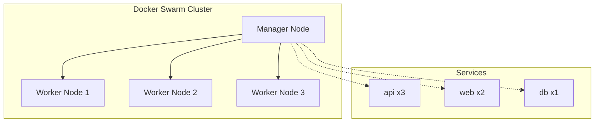
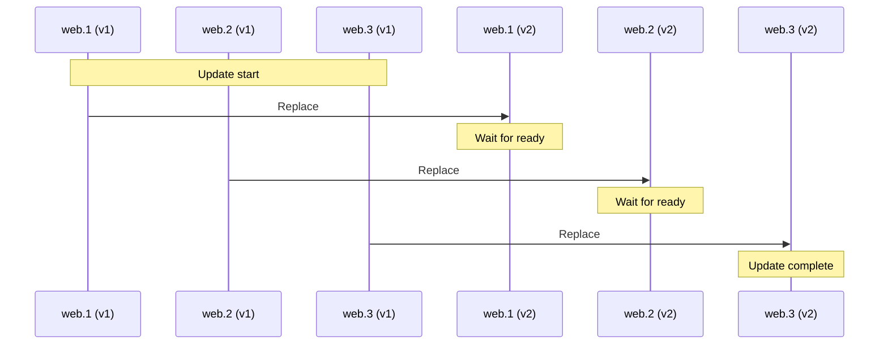

# Docker Swarm Basics

Docker Swarm — built-in orchestrator for managing containers across multiple servers.

## What is Docker Swarm?



### Why Swarm?

| Without Swarm | With Swarm |
|---------------|------------|
| Manual container startup | Declarative description |
| Container crash = downtime | Automatic restart |
| Manual scaling | `replicas: 5` |
| Update with downtime | Rolling updates |
| Secrets in variables | Encrypted Secrets |

## Initializing Swarm

```bash
# On first server (becomes manager)
docker swarm init

# On other servers (become workers)
docker swarm join --token SWMTKN-xxx manager-ip:2377

# Check nodes
docker node ls
```

## Core Concepts

### Service

Service — definition of how to run containers.

```bash
# Create service
docker service create --name web --replicas 3 -p 80:80 nginx

# List services
docker service ls

# Service status
docker service ps web

# Scale
docker service scale web=5

# Update image
docker service update --image nginx:1.25 web
```

### Task

Task — one running container of a service.

```
Service: web (replicas: 3)
├── Task: web.1 → Container → Node 1
├── Task: web.2 → Container → Node 2
└── Task: web.3 → Container → Node 3
```

### Stack

Stack — group of related services from docker-stack.yml.

```yaml
# docker-stack.yml
services:
  web:
    image: nginx:alpine
    ports:
      - "80:80"
    deploy:
      replicas: 2
  
  api:
    image: my-api:latest
    deploy:
      replicas: 3

networks:
  default:
    driver: overlay
```

```bash
# Deploy stack
docker stack deploy -c docker-stack.yml myapp

# List stacks
docker stack ls

# Stack services
docker stack services myapp

# Remove stack
docker stack rm myapp
```

## deploy Section

In Docker Swarm, the `deploy` section defines service behavior:

```yaml
services:
  api:
    image: api:latest
    deploy:
      # Number of replicas
      replicas: 3
      
      # Update strategy
      update_config:
        parallelism: 1        # Update 1 replica at a time
        delay: 10s            # Delay between updates
        failure_action: rollback
      
      # Restart policy
      restart_policy:
        condition: on-failure
        delay: 5s
        max_attempts: 3
      
      # Resource limits
      resources:
        limits:
          cpus: "2.0"
          memory: 2G
        reservations:
          cpus: "0.5"
          memory: 512M
      
      # Node placement
      placement:
        constraints:
          - node.role == worker
          - node.labels.type == compute
```

## Networks in Swarm

### Overlay Networks

Overlay networks allow containers on different nodes to communicate.

```yaml
networks:
  frontend:
    driver: overlay
  backend:
    driver: overlay
    attachable: true  # Allows connecting regular containers
```

### Internal DNS

Containers reach each other by service name:

```bash
# From web container
curl http://api:3000  # api — service name
```

## Secrets

Secrets — encrypted data for passwords and keys.

```bash
# Create secret
echo "mysecretpassword" | docker secret create db_password -

# List secrets
docker secret ls

# Remove secret
docker secret rm db_password
```

### Usage in docker-stack.yml

```yaml
services:
  api:
    image: api:latest
    secrets:
      - db_password
    environment:
      DATABASE_PASSWORD_FILE: /run/secrets/db_password

secrets:
  db_password:
    external: true
```

Secret is mounted as file `/run/secrets/db_password`.

## Rolling Updates

Swarm updates services gradually, without downtime:



## Comparison with Kubernetes

| Criterion | Docker Swarm | Kubernetes |
|-----------|--------------|------------|
| Complexity | Simple | Complex |
| Installation | 1 command | Many components |
| Learning curve | Minutes | Weeks |
| Scale | Up to 100 nodes | Up to 5000 nodes |
| Ecosystem | Basic | Huge |
| Target | Small/medium projects | Enterprise |

SwarmCLI chose Docker Swarm for simplicity and sufficiency for typical projects.

## Essential Commands

### Cluster Management

```bash
# Cluster status
docker info | grep Swarm

# List nodes
docker node ls

# Leave Swarm
docker swarm leave --force
```

### Service Management

```bash
# List services
docker service ls

# Service details
docker service inspect api

# Service logs
docker service logs api --tail 100 -f

# Service tasks
docker service ps api
```

### Stack Management

```bash
# Deploy
docker stack deploy -c docker-stack.yml myapp

# List stacks
docker stack ls

# Stack services
docker stack services myapp

# Remove
docker stack rm myapp
```

## Relation to SwarmCLI

SwarmCLI is a layer on top of Docker Swarm:

| Docker Swarm | SwarmCLI |
|--------------|----------|
| `docker stack deploy` | `swarmcli deploy` |
| Manual image builds | Automatic from Git |
| Manual secret management | `swarmcli secret` |
| No history | History + rollback |
| No profiles | Server profiles |

## Next Step

→ [Profiles](03-profiles.md) — profile concept in SwarmCLI
