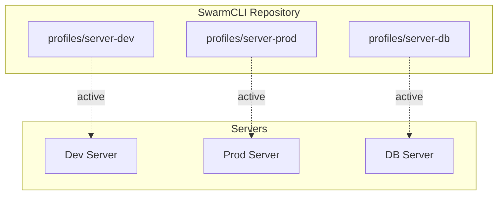

# Profiles

A profile is an isolated configuration for a server or environment.

## Concept



### Why Profiles?

| Without Profiles | With Profiles |
|------------------|---------------|
| One config for all servers | Isolated configurations |
| Different repositories | One repository |
| Variables via .env | YAML configuration |
| No secret separation | Secrets per profile |

## Profile Structure

```
swarmcli/
├── .secrets/                # Global secrets (NOT in git!)
│   ├── db_password.txt
│   └── jwt_key.pem
└── profiles/server-dev/
    ├── config.yaml          # Profile settings
    ├── scripts/             # Helper scripts
    │   └── init-db.sh
    └── stacks/              # Application stacks
        ├── globals.yaml     # Global variables
        ├── resources.yaml   # CPU/Memory limits
        ├── endpoints.yaml   # Service registry
        ├── my-app/
        ├── backend/
        └── frontend/
```

> **Important:** Secrets are stored in the global `.secrets/` directory at swarmcli root, not in profiles. This allows using the same secrets for multiple profiles on one server.

## config.yaml

Main profile configuration file:

```yaml
# Name and description
name: server-dev
description: Development server configuration

# Docker Swarm settings
swarm:
  # Service readiness timeout (sec)
  services_ready_timeout: 30
  
  # Number of image versions to keep
  # Important: without Container Registry old images cannot be restored!
  keep_images_count: 3

# Git settings
git:
  default_branch: develop           # Default branch
  http_token: ${GIT_HTTP_TOKEN}     # Token for HTTPS

# Retry logic for network operations
retry:
  enabled: true
  max_attempts: 3
  initial_delay: 2      # Initial delay (sec)
  max_delay: 30         # Maximum delay (sec)
```

## globals.yaml

Global variables for all stacks in the profile:

```yaml
# profiles/server-dev/stacks/globals.yaml

# Timezone
TZ: Europe/Moscow

# Environment
PLATFORM_ENV: development

# Log level
LOG_LEVEL: DEBUG

# Domain
DOMAIN: dev.example.com
```

Variables are exported with `GLOBAL_` prefix:

```bash
# In docker-stack.yml
environment:
  - TZ=${GLOBAL_TZ}
  - LOG_LEVEL=${GLOBAL_LOG_LEVEL}
```

## resources.yaml

Centralized CPU/Memory resource management:

```yaml
# profiles/server-dev/stacks/resources.yaml

stacks:
  my-app:
    api:
      limits:
        cpus: "2.0"
        memory: "2G"
      reservations:
        cpus: "0.5"
        memory: "512M"
    
    worker:
      limits:
        cpus: "1.0"
        memory: "1G"
  
  backend:
    main:
      limits:
        cpus: "4.0"
        memory: "4G"
```

Resources are injected into `docker-stack.yml` automatically on deploy.

## endpoints.yaml

Service address registry for inter-service communication:

```yaml
# profiles/server-dev/stacks/endpoints.yaml

endpoints:
  core:
    backend_api:
      host: core-backend-api
      port: 8080
      description: "Backend REST API"
    
    file_uploader:
      host: ar-file-uploader
      port: 8080
  
  databases:
    postgres:
      host: postgres-server
      port: 5432
    
    redis:
      host: redis-server
      port: 6379
```

Generates `SERVICE_*` variables:

```yaml
# In stack variables.yaml
runtime:
  env:
    BACKEND_URL: ${SERVICE_CORE_BACKEND_API_URL}
    REDIS_HOST: ${SERVICE_DATABASES_REDIS_HOST}
```

## Working with Profiles

### List Profiles

```bash
swarmcli profile ls
```

```
Available profiles:

● server-dev
    Description: Development server
    Stacks: 17

● server-prod
    Description: Production server
    Stacks: 18

● server-db
    Description: Database server
    Stacks: 1
```

### Profile Information

```bash
swarmcli profile inspect server-dev
```

### Setting Default Profile

```bash
# Set
swarmcli use server-dev

# Show current
swarmcli use --show

# Clear
swarmcli use --clear
```

### Switching Between Profiles

```bash
# Via --profile
swarmcli ls --profile server-prod

# Via use
swarmcli use server-prod
swarmcli ls
```

## Practical Examples

### Development vs Production

```yaml
# profiles/server-dev/config.yaml
git:
  default_branch: develop

# profiles/server-prod/config.yaml
git:
  default_branch: main
```

```yaml
# profiles/server-dev/stacks/globals.yaml
LOG_LEVEL: DEBUG
PLATFORM_ENV: development

# profiles/server-prod/stacks/globals.yaml
LOG_LEVEL: INFO
PLATFORM_ENV: production
```

### Different Resources

```yaml
# profiles/server-dev/stacks/resources.yaml
stacks:
  my-app:
    api:
      limits:
        cpus: "1.0"
        memory: "1G"

# profiles/server-prod/stacks/resources.yaml
stacks:
  my-app:
    api:
      limits:
        cpus: "4.0"
        memory: "8G"
```

### Secrets

Secrets are stored in the global `.secrets/` directory at swarmcli root:

```
.secrets/
├── db_password.txt       # DB password
├── jwt_private_key.pem    # JWT key
└── api_key.txt           # API key
```

> **Note:** Each server (dev, prod) will have its own secrets. Files with the same names contain different values on different servers.

## Best Practices

### 1. Profile Naming

```
server-<role>
├── server-dev       # Development
├── server-staging   # Staging
├── server-prod      # Production
├── server-db        # Database
└── server-ml        # Machine Learning
```

### 2. One Repository — All Profiles

Keep all profiles in one repository for:
- Single source of truth
- Easy synchronization
- Version control of all configurations

### 3. Secrets Outside Git

```gitignore
# .gitignore
.secrets/
```

### 4. Profile per Server

On each server:

```bash
# Clone repository
git clone ... /opt/swarmcli

# Set profile
swarmcli use server-prod

# All commands will use this profile
swarmcli deploy my-app
```

## Next Step

→ [Stacks](04-stacks.md) — stack structure and configuration
