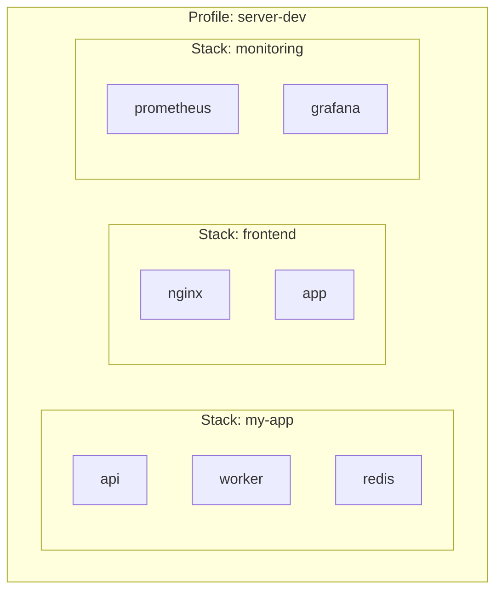
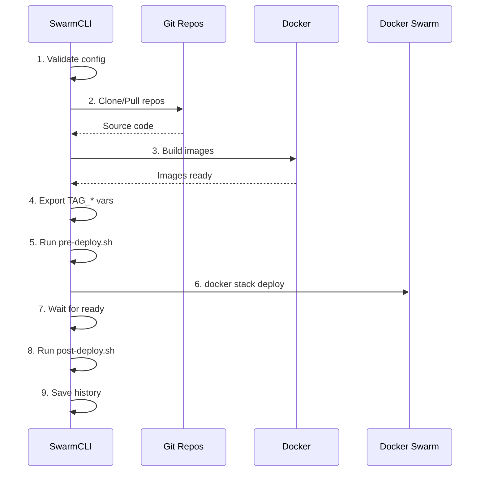

# Stacks

A stack is an application or microservice with its own deployment configuration.

## Concept



**Profile** contains **stacks**, each stack contains **services**.

## Stack Structure

```
stacks/my-app/
├── docker-stack.yml     # Docker Compose for Swarm (or templates/)
├── templates.yaml      # Jinja2 template config (optional)
├── templates/          # Jinja2 templates (optional)
│   └── docker-stack.j2
├── services.yaml       # Service descriptions
├── variables.yaml      # Build/deploy variables
├── externals.yaml      # Required secrets and configs
├── settings.yaml       # Stack settings
├── hooks/
│   ├── pre-deploy.sh   # Runs BEFORE deploy
│   └── post-deploy.sh  # Runs AFTER deploy
├── config/             # Configs (optional)
│   └── nginx.conf
├── .build/             # Generated files (server-only)
├── .deploy/            # Deploy history (server-only)
└── .repos/             # Service repositories (server-only)
```

> **Note:** Directories `.build/`, `.deploy/`, `.repos/` are created automatically and not stored in Git.

## Configuration Files

### docker-stack.yml

Standard Docker Compose file for Swarm:

```yaml
services:
  api:
    image: local/api:${TAG_API}
    ports:
      - "8080:8080"
    environment:
      - TZ=${GLOBAL_TZ}
      - LOG_LEVEL=${LOG_LEVEL}
      - DATABASE_PASSWORD_FILE=/run/secrets/db_password
    secrets:
      - db_password
    networks:
      - backend
    deploy:
      replicas: 2
      update_config:
        parallelism: 1
        delay: 10s
      restart_policy:
        condition: on-failure

  worker:
    image: local/api:${TAG_API}
    command: ["node", "worker.js"]
    environment:
      - TZ=${GLOBAL_TZ}
    networks:
      - backend
    deploy:
      replicas: 1

networks:
  backend:
    driver: overlay

secrets:
  db_password:
    external: true
```

### services.yaml

Stack service descriptions:

```yaml
services:
  # Service from Git repository
  api:
    type: git                           # Type: git (internal)
    repo: git@github.com:your-org/api.git   # Git URL
    default_branch: develop             # Default branch
    build:
      context: .                        # Build context
      dockerfile: Dockerfile            # Dockerfile
      build_args:                       # Build arguments
        NODE_ENV: production
    image: local/api                    # Image name
    meta:
      group: backend                    # Group for Dozzle
      name: API Service                 # Display name
  
  # Service from Docker Registry
  redis:
    type: registry                      # Type: registry (external)
    image: redis:7-alpine
    meta:
      group: cache
```

#### Service Types

| Type | Description | CLI Actions |
|------|-------------|-------------|
| `git` | Build from Git repository | clone → build → push → deploy |
| `registry` | Public/private Registry | deploy (no build) |

### variables.yaml

Build and runtime variables:

```yaml
# Common variables (build + runtime)
common:
  APP_VERSION: "1.0.0"

# Build variables (docker build --build-arg)
build:
  NODE_ENV: production
  NPM_TOKEN: ${NPM_TOKEN}

# Runtime env (inject_env_vars in templates)
runtime:
  env:
    LOG_LEVEL: info
    API_URL: ${SERVICE_CORE_BACKEND_API_URL}
    REDIS_HOST: ${SERVICE_DATABASES_REDIS_HOST}
```

### externals.yaml

Secrets and configs required by the stack:

```yaml
secrets:
  - db_password
  - jwt_private_key
  - api_key
```

On deploy, SwarmCLI verifies all secrets exist.

### settings.yaml

Stack-specific settings:

```yaml
# Readiness timeout (overrides profile)
services_ready_timeout: 60

# Log lines for diagnostics
diagnostics_logs_tail: 50
```

## Hooks

### pre-deploy.sh

Runs **before** `docker stack deploy`:

```bash
#!/usr/bin/env bash
# Available variables:
# - STACK: stack name
# - SWARM_PROFILE: active profile

echo "Pre-deploy: $STACK"

# Example: database migration
docker exec db psql -c "SELECT 1"
```

### post-deploy.sh

Runs **after** successful deploy:

```bash
#!/usr/bin/env bash

echo "Post-deploy: $STACK"

# Example: send notification
curl -X POST https://hooks.example.com/deploy \
  -d "{\"stack\":\"$STACK\",\"status\":\"success\"}"
```

## Deploy Lifecycle



## Stack Commands

```bash
# List stacks
swarmcli ls

# Stack status
swarmcli ps my-app

# Detailed information
swarmcli inspect my-app

# Configuration validation
swarmcli check my-app

# Deploy
swarmcli deploy my-app

# Deploy specific service
swarmcli deploy my-app --service api

# Deploy branch
swarmcli deploy my-app --branch feature/new

# Rollback
swarmcli rollback my-app

# Logs
swarmcli logs my-app --service api
```

## Image Tags

SwarmCLI automatically generates tags for internal services:

```
TAG_<SERVICE> = <profile>-<commit_sha>
```

Example:
```bash
TAG_API=server-dev-abc1234
TAG_WORKER=server-dev-abc1234
```

Usage in `docker-stack.yml`:
```yaml
services:
  api:
    image: local/api:${TAG_API}
```

## Best Practices

### 1. One Stack = One Application

```
stacks/
├── user-service/      # User microservice
├── order-service/     # Order microservice
├── notification/       # Notification service
└── gateway/           # API Gateway
```

### 2. Services in One Stack — Related

```yaml
# my-app/services.yaml
services:
  api:           # API
  worker:        # Worker (same code)
  scheduler:     # Scheduler (same code)
```

### 3. External Dependencies — Separate

```
stacks/
├── my-app/           # Application
└── infrastructure/   # Redis, RabbitMQ
```

### 4. Use Hooks for Migrations

```bash
# pre-deploy.sh
if [ -f "migrations/pending" ]; then
  docker exec db-container run-migrations
fi
```

## Next Step

→ [Services](05-services.md) — service types and configuration
