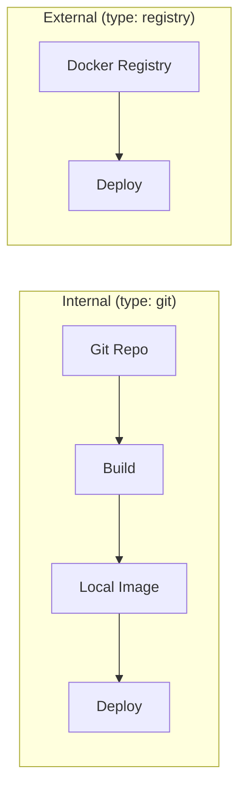

# Services

A service is a stack component that runs as a Docker container.

## Service Types

SwarmCLI distinguishes two service types:



### Internal Service (type: git)

Service built from Git repository:

```yaml
# services.yaml
services:
  api:
    type: git                             # Type: git
    repo: git@github.com:your-org/api.git     # Git URL
    default_branch: develop               # Default branch
    build:
      context: .                          # Build context
      dockerfile: Dockerfile               # Dockerfile path
      build_args:                         # Build arguments
        NODE_ENV: production
    image: local/api                      # Image name
    meta:
      group: backend                      # Dozzle group
      name: API Service                   # Dozzle name
```

**What CLI does:**
1. Clones/updates repository
2. Builds image (`docker build`)
3. Generates tag: `<profile>-<commit_sha>`
4. Deploys with this tag

### External Service (type: registry)

Service from Docker Registry (Docker Hub, GitLab Registry, etc.):

```yaml
services:
  redis:
    type: registry                        # Type: registry
    image: redis:7-alpine                 # Full image path
    meta:
      group: cache
```

**What CLI does:**
- Deploys directly (no build)
- Image is pulled from Registry

## services.yaml Structure

### Full Example

```yaml
services:
  # === Internal services ===
  
  api:
    type: git
    repo: git@github.com:your-org/backend.git
    default_branch: develop
    build:
      context: .
      dockerfile: Dockerfile
      build_args:
        NODE_ENV: production
        BUILD_VERSION: ${BUILD_VERSION}
    image: local/api
    meta:
      group: core
      name: Backend API
  
  worker:
    type: git
    repo: git@github.com:your-org/backend.git    # Same repo
    default_branch: develop
    build:
      context: .
      dockerfile: Dockerfile.worker           # Different Dockerfile
    image: local/worker
    meta:
      group: core
      name: Background Worker
  
  # === External services ===
  
  redis:
    type: registry
    image: redis:7-alpine
    meta:
      group: infrastructure
  
  postgres:
    type: registry
    image: postgres:15
    meta:
      group: databases
      name: PostgreSQL
  
  nginx:
    type: registry
    image: nginx:1.25-alpine
    meta:
      group: frontend
```

## services.yaml Fields

### Common Fields

| Field | Type | Description |
|-------|------|-------------|
| `type` | `git` \| `registry` | Service type (required) |
| `image` | string | Image name |
| `meta.group` | string | Group for Dozzle labels |
| `meta.name` | string | Display name |

### Fields for type: git

| Field | Type | Description |
|-------|------|-------------|
| `repo` | string | Git repository URL |
| `default_branch` | string | Default branch |
| `build.context` | string | Build context (default: `.`) |
| `build.dockerfile` | string | Dockerfile path (default: `Dockerfile`) |
| `build.build_args` | map | Build arguments |

## Dozzle Labels

SwarmCLI automatically generates labels for [Dozzle](https://github.com/amir20/dozzle):

```yaml
# services.yaml
services:
  api:
    type: git
    meta:
      group: backend        # → dev.dozzle.group: backend
      name: API Service     # → dev.dozzle.name: API Service
```

Result in docker-stack.yml:

```yaml
deploy:
  labels:
    dev.dozzle.group: backend
    dev.dozzle.name: API Service
```

## Use Cases

### One Repo — Multiple Services

```yaml
services:
  api:
    type: git
    repo: git@github.com:your-org/monorepo.git
    build:
      context: ./services/api
      dockerfile: Dockerfile
    image: local/api
  
  worker:
    type: git
    repo: git@github.com:your-org/monorepo.git
    build:
      context: ./services/worker
      dockerfile: Dockerfile
    image: local/worker
```

### Microservices from Different Repos

```yaml
services:
  user-service:
    type: git
    repo: git@github.com:your-org/user-service.git
    image: local/user-service
  
  order-service:
    type: git
    repo: git@github.com:your-org/order-service.git
    image: local/order-service
```

### Public Images + Your Application

```yaml
services:
  api:
    type: git
    repo: git@github.com:your-org/api.git
    image: local/api
  
  redis:
    type: registry
    image: redis:7-alpine
  
  postgres:
    type: registry
    image: postgres:15
```

## Image Tags

### Tag Generation

For `type: git` SwarmCLI generates:

```
TAG_<SERVICE> = <profile>-<commit_sha>
```

Example:
```bash
# Commit abc1234 on server-dev
TAG_API=server-dev-abc1234
TAG_WORKER=server-dev-abc1234
```

### Usage in docker-stack.yml

```yaml
services:
  api:
    image: local/api:${TAG_API}
  
  worker:
    image: local/worker:${TAG_WORKER}
  
  # External services don't need tag
  redis:
    image: redis:7-alpine
```

### Branch Override

```bash
# Specific service from feature branch
swarmcli deploy my-app --service api --branch feature/new-api

# Multiple services from different branches
swarmcli deploy my-app \
  --service api --branch feature/new-api \
  --service worker --branch hotfix/fix
```

## Build Args

### Static Arguments

```yaml
services:
  api:
    build:
      build_args:
        NODE_ENV: production
        API_VERSION: "2.0"
```

### Dynamic Arguments

From `variables.yaml`:

```yaml
# variables.yaml
build:
  NPM_TOKEN: ${NPM_TOKEN}     # From env
  BUILD_DATE: ${BUILD_DATE}    # From env
```

SwarmCLI passes them to `docker build --build-arg`.

## Validation

```bash
# Check services.yaml
swarmcli check my-app
```

Checks:
- Required fields present
- Valid type
- Repository accessibility (for git)

## Best Practices

### 1. Specify type Explicitly

```yaml
# Good
services:
  api:
    type: git
    ...

# Bad (implicit)
services:
  api:
    repo: git@...
```

### 2. Use meta for Dozzle

```yaml
meta:
  group: backend
  name: User API
```

### 3. Group Logically

```
group: core         # Core services
group: analytics    # Analytics
group: infrastructure  # Redis, RabbitMQ
group: databases    # PostgreSQL, MongoDB
```

### 4. Name Images Consistently

```yaml
image: local/api            # Local images
image: local/worker
image: registry.com/api     # Private registry
```

## Next Step

→ [Deploy Flow](06-deploy-flow.md) — detailed deploy flow
