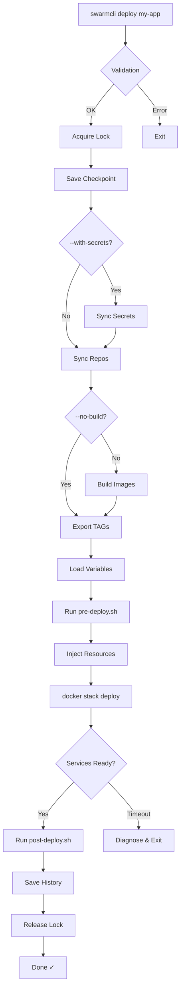
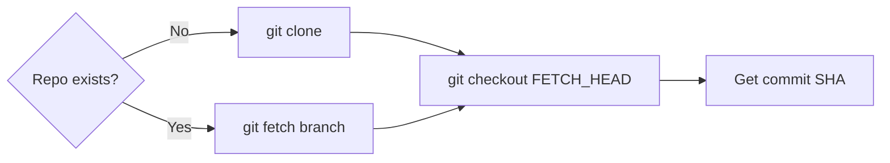
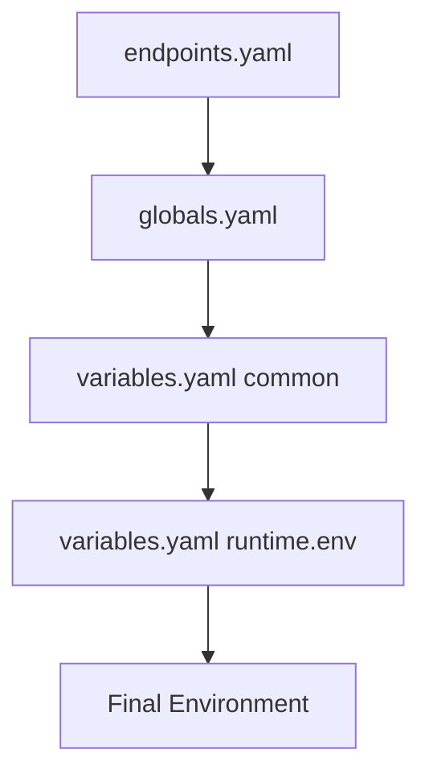
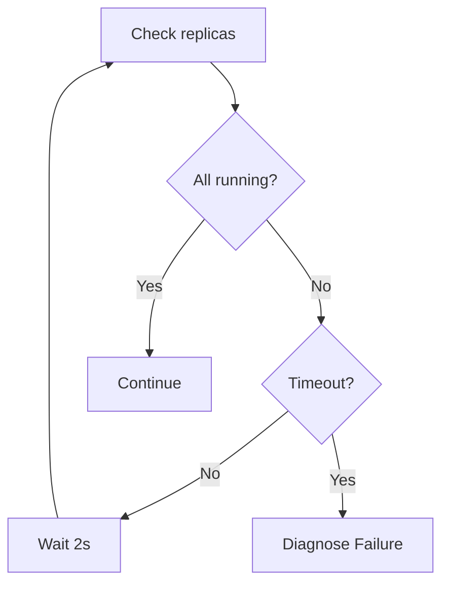

# Deploy Flow

Detailed description of what happens when running `swarmcli deploy`.

## Overview



## Deploy Stages

### 1. Configuration Validation

```bash
🔍 Checking configurations...
```

Checked:
- Stack directory exists
- `docker-stack.yml` present
- `services.yaml` valid
- Repositories exist (for git services)
- Required secrets present

### 2. Deployment Lock

SwarmCLI uses atomic locks to prevent parallel deploys:

```bash
# Lock directory created
.locks/deploy_my-app/
```

If lock is held:
```
✗ cannot acquire deployment lock
✗ another deployment is in progress
```

### 3. Checkpoint

Current state saved for possible rollback:

```bash
profiles/server-dev/stacks/my-app/.deploy/checkpoint.json
```

### 4. Secret Sync

If `--with-secrets` specified:

```bash
🔐 Syncing secrets...
```

- Reads files from `.secrets/`
- Creates/updates Docker secrets

### 5. Repository Sync

```bash
🔄 Syncing repositories...
```

For each git service:



> **Note:** After fetch, repository enters detached HEAD state on latest remote branch commit. This ensures code freshness without stale local branch issues.

### 6. Image Build

```bash
🔨 Building images...
```

For each git service:

```bash
docker build \
  -f Dockerfile \
  -t local/api:server-dev-abc1234 \
  --build-arg NODE_ENV=production \
  --build-arg CACHE_BUST=abc1234-1703152800 \
  .
```

**Retry logic:**
- On network error — exponential backoff
- Up to 3 attempts by default

### 7. Export TAG Variables

```bash
TAG_API=server-dev-abc1234
TAG_WORKER=server-dev-abc1234
```

Variables used in `docker-stack.yml`:

```yaml
services:
  api:
    image: local/api:${TAG_API}
```

### 8. Load Variables

Load order:



Result:
```bash
GLOBAL_TZ=Europe/Moscow
LOG_LEVEL=info
SERVICE_CORE_API_URL=http://api:8080
```

### 9. Pre-deploy Hook

```bash
hooks/pre-deploy.sh
```

Available variables:
- `$STACK` — stack name
- `$SWARM_PROFILE` — active profile
- All `TAG_*`, `GLOBAL_*`, variables from `runtime.env`

### 10. Resource Injection

For stacks with j2 templates, resources are injected via `deploy_resources()` in the template.

For legacy stacks (without j2), resources are added directly to docker-stack.yml.

**Adds resources:**
```yaml
deploy:
  resources:
    limits:
      cpus: "2.0"
      memory: "2G"
```

**Adds Dozzle labels:**
```yaml
deploy:
  labels:
    dev.dozzle.group: backend
    dev.dozzle.name: API Service
```

**Injects runtime.env variables (via inject_env_vars):**
```yaml
environment:
  - LOG_LEVEL=info
```

### 11. Docker Stack Deploy

```bash
docker stack deploy -c /tmp/composed-xxxxx.yml my-app
```

SwarmCLI uses a temporary file with injected resources.

### 12. Wait for Readiness

```bash
waiting for services to be ready (timeout: 30s)
```

Replica status is checked:



On timeout — diagnostics:
- Task status
- Recent logs
- Troubleshooting hints

### 13. Post-deploy Hook

```bash
hooks/post-deploy.sh
```

Runs only on successful deploy.

### 14. Save History

```jsonl
{"timestamp":"2024-12-21T10:00:00Z","profile":"server-dev","status":"success","services":[...]}
```

History used for rollback.

### 15. Release Lock

Lock released automatically:
- On success
- On error
- On interrupt (Ctrl+C)

## Deploy Modes

### Full Deploy

```bash
swarmcli deploy my-app
```
- Sync repos → Build → Deploy

### Config Only

```bash
swarmcli deploy my-app --config-only
```
- Skips sync/build
- Uses current image tags
- For applying variables.yaml changes

### No Build

```bash
swarmcli deploy my-app --no-build
```
- Sync repos (to get SHA)
- Skips build
- Deploy with new tags

### Specific Service

```bash
swarmcli deploy my-app --service api
```
- Sync/build only for api
- Other services — current tags

### Feature Branch

```bash
swarmcli deploy my-app --branch feature/new
```
- All services from specified branch

### Dry Run

```bash
swarmcli deploy my-app --dry-run
```
- Shows plan without execution
- Validates configuration

## Deploy Flags

| Flag | Description |
|------|-------------|
| `--profile <name>` | Override default profile (optional) |
| `--branch <name>` | Branch for all services |
| `--service <name>` | Deploy specific service |
| `--with-secrets` | Sync secrets |
| `--no-build` | Skip build |
| `--config-only` | Config only (no rebuild) |
| `--force` | Force rebuild |
| `--dry-run` | Preview without execution |
| `--prune` | Remove old images |
| `--no-cache` | Disable Docker cache |

## Error Handling

### Validation Error

```
✗ Validation error (3 issues)
```

Deploy aborted before work starts.

### Build Error

```
✗ build failed for api after retries
```

- Deploy aborted
- Lock released
- History not saved

### Readiness Timeout

```
✗ timeout waiting for services to be ready
```

Diagnostics shown:
- Task status
- Service logs
- Hints

### Hook Error

```
✗ hook pre-deploy.sh failed with exit code 1
```

On pre-deploy error — deploy aborted.

## Rollback

On issues:

```bash
swarmcli rollback my-app
```

Process:
1. Reads deploy history
2. Finds previous successful deploy
3. Rebuilds images from those commits
4. Deploys

```bash
# Rollback 2 versions back
swarmcli rollback my-app --to-version 2
```

## Monitoring

### Status During Deploy

```bash
waiting for services to be ready (timeout: 30s)
  my-app_api: 1/2 (waiting...)
  my-app_worker: 0/1 (waiting...)
```

### After Deploy

```bash
   ✅ Deploy completed successfully
   ├─ Stack: my-app
   ├─ Services: 3
   └─ Time: 45s
```

## Best Practices

### 1. Use --dry-run

```bash
swarmcli deploy my-app --dry-run
```

### 2. Monitor Logs

```bash
# In separate terminal
swarmcli logs my-app --service api -f
```

### 3. Start with Dev

```bash
# On a single server the default profile is already set:
swarmcli deploy my-app

# If managing multiple servers, override the profile:
swarmcli deploy my-app --profile server-dev
swarmcli deploy my-app --profile server-prod
```

### 4. Keep History

Deploy history in `stacks/<stack>/.deploy/` — foundation for rollback.

---

## See Also

- [CLI Reference](../03-reference/cli/) — all commands
- [Troubleshooting](../05-operations/troubleshooting/) — problem solving
