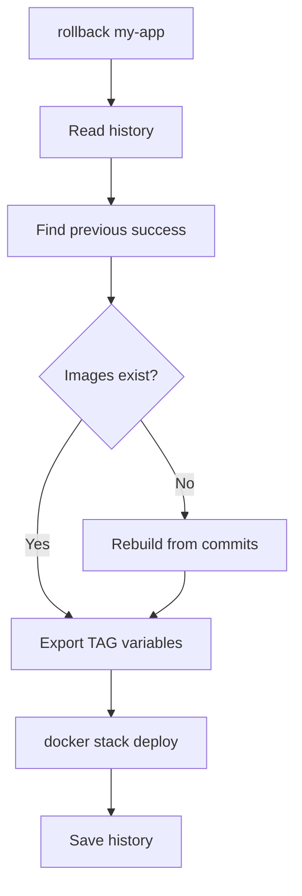

# Rollback

How to revert to a previous version when issues occur.

## Quick Rollback

```bash
swarmcli rollback my-app
```

Rolls back to the previous successful version.

## Rollback to Specific Version

```bash
# 2 versions back
swarmcli rollback my-app --to-version 2

# 5 versions back
swarmcli rollback my-app --to-version 5
```

## How Rollback Works



## Deploy History

SwarmCLI stores history **inside each stack** in the `.deploy/` folder. History is pruned to keep the last `keep_images_count` records (same as image retention).

```bash
cat profiles/server-dev/stacks/my-app/.deploy/history.jsonl
```

```jsonl
{"timestamp":"2024-12-21T10:00:00Z","profile":"server-dev","status":"success","services":[...]}
{"timestamp":"2024-12-21T11:00:00Z","profile":"server-dev","status":"success","services":[...]}
{"timestamp":"2024-12-21T12:00:00Z","profile":"server-dev","status":"failed","services":[...]}
```

## Dry-run Rollback

View plan without execution:

```bash
swarmcli rollback my-app --dry-run
```

```
Would rollback to:
  Timestamp: 2024-12-21T10:00:00Z
  Services:
    - api: server-dev-abc1234 (commit: abc1234)
    - worker: server-dev-abc1234 (commit: abc1234)
```

## When to Use Rollback

✅ **Use rollback:**
- Service doesn't start after deploy
- Critical bug in new version
- Need to quickly return to working state

❌ **Don't use rollback:**
- Configuration issue (fix config and redeploy)
- DB schema changed (migrations are irreversible)
- Need specific version (use `--branch`)

## Image Retention

⚠️ **Important:** Rollback only works if images are retained!

### Retention Settings

```yaml
# config.yaml
swarm:
  keep_images_count: 5  # Keep 5 versions
```

### Check Images

```bash
docker images | grep local/api
```

### Image Recovery

If image was removed, SwarmCLI will try to rebuild from saved commit:

```
✗ image not found: local/api:server-dev-abc1234
  rebuilding from commit abc1234...
✓ successfully rebuilt
```

## Rollback Single Service

SwarmCLI rolls back the entire stack. For single service rollback:

```bash
# Manual service rollback
docker service update --image local/api:server-dev-previous my-app_api
```

## Rollback Issues

### "no deploy history found"

History not saved. Deploy with SwarmCLI to save history.

### "commit not found"

Commit was removed from repository:

```bash
# Check commit
git -C repos/api rev-parse abc1234
```

### "image rebuild failed"

Repository changed and old code doesn't build:

```bash
# Try different version
swarmcli rollback my-app --to-version 2
```

## Best Practices

### 1. Keep Enough Versions

```yaml
keep_images_count: 5  # Minimum 3
```

### 2. Don't Delete History

```bash
# Don't do this!
rm -rf profiles/server-dev/stacks/my-app/.deploy/
```

### 3. Test Rollback in Advance

```bash
# On dev environment
swarmcli deploy my-app
swarmcli rollback my-app --dry-run
```

### 4. Monitor After Rollback

```bash
swarmcli ps my-app
swarmcli logs my-app --service api
```

## Rollback Alternatives

### Docker Service Rollback

```bash
docker service rollback my-app_api
```

Rolls back to previous service spec (not SwarmCLI version).

### Manual Deploy of Old Branch

```bash
swarmcli deploy my-app --branch v1.2.3
```

### Restore from Backup

For stateful services (DB) — restore data + rollback code.

## Next Step

→ [Troubleshooting](../../05-operations/troubleshooting/)
