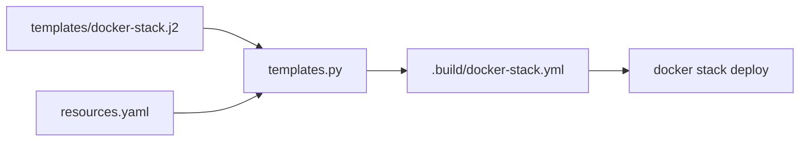

# Resource Management

Centralized CPU and Memory management for services.

## Concept

SwarmCLI uses a centralized `resources.yaml` file at the profile level:

```
profiles/server-dev/stacks/
├── resources.yaml       # ← All limits here
├── my-app/
│   └── docker-stack.yml # No resources section
├── backend/
│   └── docker-stack.yml # No resources section
```

**Benefits:**
- Single file for all profile resources
- Easy to compare dev vs prod
- No need to edit each docker-stack.yml

## resources.yaml

```yaml
# profiles/server-dev/stacks/resources.yaml

stacks:
  my-app:
    api:
      limits:
        cpus: "2.0"
        memory: "2G"
      reservations:
        cpus: "0.5"
        memory: "512M"
    
    worker:
      limits:
        cpus: "1.0"
        memory: "1G"
      reservations:
        cpus: "0.25"
        memory: "256M"
  
  backend:
    main:
      limits:
        cpus: "4.0"
        memory: "4G"
      reservations:
        cpus: "1.0"
        memory: "1G"
```

## Structure

```yaml
stacks:
  <stack-name>:              # Stack name
    <service-name>:          # Service name
      limits:                # Hard limits
        cpus: "2.0"          # Max CPU cores
        memory: "2G"         # Max memory
      reservations:          # Guaranteed resources
        cpus: "0.5"          # Min CPU cores
        memory: "512M"       # Min memory
```

## How It Works

On `swarmcli deploy`:



1. CLI reads `docker-stack.yml`
2. CLI reads `resources.yaml`
3. Python script injects resources
4. Temporary compose file is created
5. `docker stack deploy` uses it

## Before and After

### docker-stack.yml (original)

```yaml
services:
  api:
    image: local/api:${TAG_API}
    # No resources section
```

### docker-stack.yml (after injection)

```yaml
services:
  api:
    image: local/api:${TAG_API}
    deploy:
      resources:
        limits:
          cpus: "2.0"
          memory: "2G"
        reservations:
          cpus: "0.5"
          memory: "512M"
```

## Different Resources for Dev/Prod

```yaml
# profiles/server-dev/stacks/resources.yaml
stacks:
  my-app:
    api:
      limits:
        cpus: "1.0"
        memory: "1G"

# profiles/server-prod/stacks/resources.yaml
stacks:
  my-app:
    api:
      limits:
        cpus: "4.0"
        memory: "8G"
```

## Checking Resources

### View Current Limits

```bash
docker service inspect my-app_api --format '{{.Spec.TaskTemplate.Resources}}'
```

### Monitor Usage

```bash
docker stats
```

## Best Practices

### 1. Always Specify Limits

```yaml
limits:
  cpus: "2.0"
  memory: "2G"
```

Without limits, a container can use all server resources.

### 2. Reservations for Critical Services

```yaml
reservations:
  cpus: "0.5"
  memory: "512M"
```

Guarantees the service receives these resources.

### 3. Leave Headroom for System

On a server with 16GB RAM:

```yaml
# Don't allocate everything
api:      4G
worker:   2G
db:       4G
cache:    2G
# --------
# Total:  12G (4GB left for system)
```

### 4. CPU as Strings

```yaml
# Correct
cpus: "2.0"
cpus: "0.5"

# Incorrect (may cause parsing error)
cpus: 2.0
cpus: 0.5
```

### 5. Memory with Units

```yaml
# Supported formats
memory: "512M"
memory: "2G"
memory: "2048M"
```

## Example for Typical Project

```yaml
# resources.yaml
stacks:
  # Main backend
  backend:
    api:
      limits:
        cpus: "2.0"
        memory: "2G"
      reservations:
        cpus: "0.5"
        memory: "512M"
    
    worker:
      limits:
        cpus: "1.0"
        memory: "1G"
    
    scheduler:
      limits:
        cpus: "0.5"
        memory: "512M"
  
  # Frontend
  frontend:
    nginx:
      limits:
        cpus: "0.5"
        memory: "256M"
    
    app:
      limits:
        cpus: "1.0"
        memory: "1G"
  
  # Infrastructure
  infrastructure:
    redis:
      limits:
        cpus: "1.0"
        memory: "1G"
    
    postgres:
      limits:
        cpus: "2.0"
        memory: "4G"
      reservations:
        cpus: "1.0"
        memory: "2G"
```

## Troubleshooting

### "service not converging"

Possibly insufficient resources on node:

```bash
# Check available resources
docker node ls
docker info | grep -E "CPUs|Memory"
```

### "OOMKilled"

Service exceeded memory limit:

```bash
# Increase limit
memory: "4G"  # Was 2G
```

### Resources Not Applied

Check:
1. Stack name in resources.yaml matches directory name
2. Service name matches name in docker-stack.yml
3. Python is available on server

## Next Step

→ [Secrets Management](../secrets/00-overview.md)
