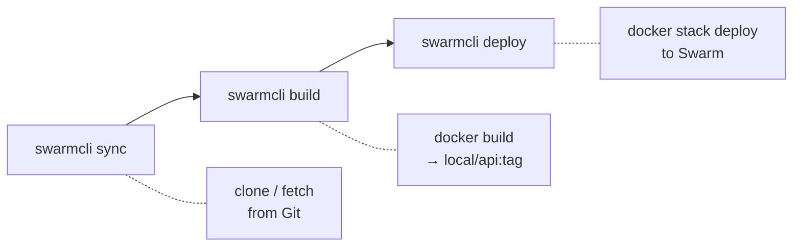

# Git-Based Stack Workflow

End-to-end guide for creating, building, and deploying stacks that use Git repositories.

## Quick Start

A minimal git-based stack requires three files:

```
stacks/my-app/
├── services.yaml        # Service definitions (repo URL, image name)
├── docker-stack.yml     # Docker Compose for Swarm
└── settings.yaml        # Timeouts
```

### services.yaml

```yaml
services:
  api:
    type: git
    repo: https://github.com/your-org/api.git
    default_branch: main
    build:
      context: .
      dockerfile: Dockerfile
    image: local/api
```

### docker-stack.yml

```yaml
services:
  api:
    image: local/api:${TAG_API}
    ports:
      - "8080:8080"
    deploy:
      replicas: 2
```

### settings.yaml

```yaml
services_ready_timeout: 60
```

### Deploy

```bash
swarmcli deploy my-app
```

This single command runs the full pipeline: sync repository, build image, deploy to Swarm.

---

## The Pipeline: sync -> build -> deploy

For git-based stacks, `swarmcli deploy` executes three stages automatically. You can also run each stage independently.



### Stage 1: Sync

```bash
swarmcli sync my-app
```

Clones or updates the Git repository for each `type: git` service:

- **First run**: `git clone` into `stacks/my-app/.repos/api/`
- **Subsequent runs**: `git fetch` + `git checkout FETCH_HEAD` (detached HEAD on latest remote commit)

### Stage 2: Build

```bash
swarmcli build my-app
```

Builds a Docker image for each `type: git` service:

```bash
docker build -f Dockerfile -t local/api:server-dev-abc1234 .
```

The tag format is `<profile>-<short_commit_sha>`. If the image already exists, build is skipped.

### Stage 3: Deploy

```bash
swarmcli deploy my-app
```

Exports `TAG_*` variables, then runs `docker stack deploy`. When called without `--no-build`, deploy runs sync and build automatically.

---

## Repository Authentication

### Public repositories (no configuration needed)

Public HTTPS repositories work out of the box:

```yaml
services:
  api:
    type: git
    repo: https://github.com/traefik/whoami.git
    image: local/whoami
```

No tokens or credentials are required.

### Private repositories (HTTPS with token)

Set the token as an environment variable:

```bash
export GIT_HTTP_TOKEN="ghp_xxxxxxxxxxxx"
```

Or configure it in `.swarmcli.yaml` / profile `config.yaml`:

```yaml
git:
  http_token: ${GIT_HTTP_TOKEN}
```

SwarmCLI uses `GIT_ASKPASS` internally, so credentials are never visible in `ps aux`.

### Private repositories (SSH)

Use an SSH URL in `services.yaml`:

```yaml
services:
  api:
    type: git
    repo: git@github.com:your-org/api.git
    image: local/api
```

The SSH key must be available to the system user running SwarmCLI.

### Per-stack credential override

When a stack uses a different Git account (e.g., a vendor repository), override credentials in `settings.yaml`:

```yaml
# stacks/vendor-app/settings.yaml
git:
  http_user: ${GIT_HTTP_USER_VENDOR}
  http_token: ${GIT_HTTP_TOKEN_VENDOR}
```

```bash
export GIT_HTTP_TOKEN_VENDOR="glpat-xxxxxxxxxxxx"
swarmcli deploy vendor-app
```

---

## Image Tagging (TAG_* Variables)

SwarmCLI generates a `TAG_<SERVICE>` environment variable for each `type: git` service. This variable is used in `docker-stack.yml` for image versioning.

### Tag format

```
TAG_<SERVICE> = <active_profile>-<short_commit_sha>
```

### Naming rules

The service name is **uppercased** and **hyphens are replaced with underscores**:

| Service name | Variable | Example value |
|--------------|----------|---------------|
| `api` | `TAG_API` | `server-dev-abc1234` |
| `worker` | `TAG_WORKER` | `server-dev-abc1234` |
| `user-service` | `TAG_USER_SERVICE` | `server-prod-f9e2a01` |

### Usage in docker-stack.yml

Reference the variable using Docker Compose `${VAR}` syntax:

```yaml
services:
  api:
    image: local/api:${TAG_API}

  user-service:
    image: local/user-service:${TAG_USER_SERVICE}
```

> **Important:** `TAG_*` variables are only generated for `type: git` services. External (`type: registry`) services use a fixed image tag directly:
>
> ```yaml
> redis:
>   image: redis:7-alpine    # no TAG_* variable needed
> ```

### Tag resolution priority

When deploying, the tag is resolved in this order:

1. Saved expected tag from the most recent build (most reliable)
2. Resolved from the current commit SHA (for selected services)
3. Currently running service tag (for non-selected services in partial deploys)
4. Fallback: resolve from commit SHA

---

## Working with Branches

### Default branch

The `default_branch` field in `services.yaml` specifies which branch to sync:

```yaml
services:
  api:
    type: git
    default_branch: develop    # syncs 'develop' by default
```

If omitted, the value from profile `config.yaml` -> `git.default_branch` is used (defaults to `main`).

### Feature branch deploy

Deploy all services from a specific branch:

```bash
swarmcli deploy my-app --branch feature/new-api
```

### Per-service branch override

Deploy different services from different branches:

```bash
swarmcli deploy my-app \
  --service api --branch feature/auth \
  --service worker --branch hotfix/queue-fix
```

Services not mentioned with `--service` use their `default_branch`.

### Pinning to a specific commit

```bash
swarmcli deploy my-app \
  --service api --branch main --commit abc1234def
```

The sync stage fetches the branch to ensure the commit is reachable, then checks out the exact commit.

---

## Derived Services (type: none)

When multiple Docker Compose services use the **same built image** with different commands (e.g., an API server, a background worker, and a scheduler), declare only one `type: git` service and mark the others as `type: none`:

### services.yaml

```yaml
services:
  api:
    type: git
    repo: https://github.com/your-org/backend.git
    build:
      context: .
      dockerfile: Dockerfile
    image: local/backend
    meta:
      group: core
      name: Backend API

  worker:
    type: none
    meta:
      group: core
      name: Background Worker

  scheduler:
    type: none
    meta:
      group: core
      name: Task Scheduler
```

### docker-stack.yml

All three services reference the same image. Only the `api` service gets a `TAG_API` variable; the others use it too:

```yaml
services:
  api:
    image: local/backend:${TAG_API}
    command: ["./app", "serve"]
    deploy:
      replicas: 2

  worker:
    image: local/backend:${TAG_API}
    command: ["./app", "worker"]
    deploy:
      replicas: 1

  scheduler:
    image: local/backend:${TAG_API}
    command: ["./app", "scheduler"]
    deploy:
      replicas: 1
```

`type: none` services are:
- **Not synced** — no repository is cloned
- **Not built** — no separate image is created
- **Deployed** — they appear in `docker-stack.yml` and are deployed to Swarm

---

## Build Arguments

### Static build args

Define directly in `services.yaml`:

```yaml
services:
  api:
    type: git
    build:
      build_args:
        NODE_ENV: production
        APP_VERSION: "2.0"
```

### Dynamic build args from variables.yaml

```yaml
# variables.yaml
build:
  NPM_TOKEN: ${NPM_TOKEN}
  BUILD_DATE: ${BUILD_DATE}
```

SwarmCLI passes all `build:` variables to `docker build --build-arg`.

### Build timeout

For heavy builds (Java, ML), increase the timeout in `settings.yaml`:

```yaml
build_timeout: 1800  # 30 minutes
```

---

## Practical Tips

### Image naming convention

Use the `local/` prefix for locally built images to distinguish them from registry images:

```yaml
# Git services — local images
image: local/api
image: local/worker
image: local/frontend

# Registry services — full registry path
image: redis:7-alpine
image: postgres:15
image: registry.company.com/licensed-app:1.0
```

### Healthchecks

Consider the base image when writing healthchecks in `docker-stack.yml`:

| Base image | Available tools | Healthcheck example |
|------------|----------------|---------------------|
| `alpine` | `wget`, `curl` (if installed) | `wget -q --spider http://localhost:8080/health` |
| `debian/ubuntu` | `curl` | `curl -f http://localhost:8080/health` |
| `scratch` / `distroless` | None | Disable healthcheck or use the app binary |

For images built FROM `scratch`, disable the healthcheck:

```yaml
healthcheck:
  disable: true
```

### Force rebuild

If you suspect Docker cache issues, force a clean build:

```bash
swarmcli deploy my-app --force --no-cache
```

### Skip build (pre-built images)

If images are already built (e.g., in CI), skip the build stage:

```bash
swarmcli deploy my-app --no-build
```

### Config-only deploy

When you changed `docker-stack.yml` or `variables.yaml` but not the code:

```bash
swarmcli deploy my-app --config-only
```

---

## Complete Example

A real-world stack with a Go API service, a worker, and Redis:

### File structure

```
stacks/backend/
├── services.yaml
├── docker-stack.yml
├── variables.yaml
├── externals.yaml
├── settings.yaml
└── hooks/
    └── post-deploy.sh
```

### services.yaml

```yaml
services:
  api:
    type: git
    repo: https://github.com/your-org/backend.git
    default_branch: main
    build:
      context: .
      dockerfile: Dockerfile
      build_args:
        APP_ENV: production
    image: local/backend-api
    meta:
      group: backend
      name: API

  worker:
    type: none
    meta:
      group: backend
      name: Worker

  redis:
    type: registry
    image: redis:7-alpine
    meta:
      group: infrastructure
```

### docker-stack.yml

```yaml
networks:
  backend_net:
    driver: overlay

services:
  api:
    image: local/backend-api:${TAG_API}
    environment:
      TZ: ${GLOBAL_TZ}
      REDIS_URL: redis://redis:6379
      LOG_LEVEL: ${DEPLOY_LOG_LEVEL:-info}
    ports:
      - "8080:8080"
    networks:
      backend_net:
        aliases:
          - api
    secrets:
      - db_password
    deploy:
      replicas: 2
      update_config:
        parallelism: 1
        delay: 10s
        order: start-first

  worker:
    image: local/backend-api:${TAG_API}
    command: ["./app", "worker"]
    environment:
      TZ: ${GLOBAL_TZ}
      REDIS_URL: redis://redis:6379
    networks:
      - backend_net
    deploy:
      replicas: 1

  redis:
    image: redis:7-alpine
    networks:
      - backend_net
    deploy:
      replicas: 1

secrets:
  db_password:
    external: true
```

### Deploy

```bash
# Validate configuration
swarmcli check backend

# Dry run
swarmcli deploy backend --dry-run

# Full deploy
swarmcli deploy backend

# Deploy only API from a feature branch
swarmcli deploy backend --service api --branch feature/v2
```

---

## Troubleshooting

### "repo not defined for internal service"

Ensure `repo:` is set in `services.yaml` for every `type: git` service.

### "git clone failed" / "git fetch failed"

- **Public repo**: Verify the URL is correct and accessible from the server.
- **Private repo (HTTPS)**: Check that `GIT_HTTP_TOKEN` is set in the environment.
- **Private repo (SSH)**: Check that the SSH key is available (`ssh -T git@github.com`).

### "No such image" on deploy

The `docker-stack.yml` references an image tag that doesn't exist. Common causes:

- Incorrect `TAG_*` variable name (check the naming rules above).
- Build was skipped (`--no-build`) but the image was never built.
- Wrong `image:` name in `docker-stack.yml` vs `services.yaml`.

### "undefined variable TAG_*"

`TAG_*` variables are only generated for `type: git` services. If a service is `type: registry`, use the full image with tag directly:

```yaml
image: redis:7-alpine    # correct — fixed tag
image: redis:${TAG_REDIS} # wrong — TAG_REDIS does not exist
```

---

## Next Steps

- [Creating a Stack](00-create-stack.md) — full stack creation guide
- [Adding Services](01-add-services.md) — adding git and registry services
- [sync reference](../../03-reference/cli/05-sync.md) — sync command details
- [build reference](../../03-reference/cli/03-build.md) — build command details
- [deploy reference](../../03-reference/cli/01-deploy.md) — deploy command details
- [Jinja2 Templates](../templates/00-overview.md) — templated docker-stack files
