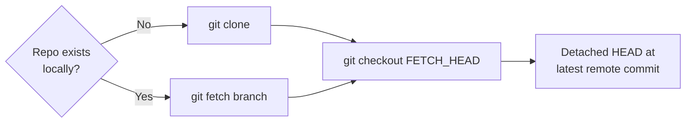

# sync

Synchronize Git repositories for stack services.

## Syntax

```bash
swarmcli sync [stack] [flags]
```

Aliases: `pull`, `repo sync`

## Description

The `sync` command clones or updates Git repositories for `type: git` services in a stack:

1. For each git service, resolve the target branch
2. Clone the repository if it does not exist locally
3. Fetch and checkout the latest commit from the target branch
4. External (`type: registry`) services are skipped

After sync, each repository is in a detached HEAD state pointing at the latest remote commit. This avoids stale local branch issues.

## Arguments

| Argument | Description |
|----------|-------------|
| `stack` | Stack name. If not specified — interactive selection |

## Flags

### Output

| Flag | Description |
|------|-------------|
| `--tree`, `-t` | Tree-style output (auto-enabled in CI) |
| `--verbose`, `-v` | Show extra details (repo paths, commit sources) |

### Service selection (global flags)

| Flag | Description |
|------|-------------|
| `--service <name>` | Sync only specified service |
| `--branch <name>` | Branch override for the preceding `--service` |
| `--commit <sha>` | Pin to a specific commit (requires `--branch`) |

### Other

| Flag | Description |
|------|-------------|
| `--dry-run` | Show plan without cloning or fetching |

## How It Works

### Git services (type: git)



- **Clone**: First sync for a service clones the full repository into `stacks/<stack>/.repos/<service>/`.
- **Fetch + checkout**: Subsequent syncs fetch only the target branch and check out `FETCH_HEAD` (or a specific commit if `--commit` is used).
- **Retry logic**: Network operations use exponential backoff (configurable via `RETRY_*` env vars).

### Registry services (type: registry)

Registry services are skipped during sync — they have no repository.

### Commit pinning

When `--commit <sha>` is specified, the sync fetches the target branch first (to ensure the commit is reachable), then checks out the exact commit:

```bash
swarmcli sync my-app --service api --branch main --commit abc1234
```

## Authentication

Sync supports three authentication methods:

1. **No auth** — Public HTTPS repositories work without any configuration.
2. **HTTPS token** — Set `GIT_HTTP_TOKEN` in the environment or configure `git.http_token` in `.swarmcli.yaml` / profile `config.yaml`. Credentials are passed via `GIT_ASKPASS` (never visible in `ps aux`).
3. **SSH key** — Use `git@` URLs. The SSH key must be available to the system user.

Per-stack credential overrides are supported via `settings.yaml`:

```yaml
git:
  http_user: ${GIT_HTTP_USER_VENDOR}
  http_token: ${GIT_HTTP_TOKEN_VENDOR}
```

## Repository Storage

Repositories are stored inside each stack directory:

```
stacks/<stack>/.repos/<service>/
```

The `.repos/` directory is created automatically and should not be committed to version control.

## Examples

### Basic sync

```bash
swarmcli sync my-app
```

### Sync specific service

```bash
swarmcli sync my-app --service api
```

### Sync from feature branch

```bash
swarmcli deploy my-app --service api --branch feature/new-api
```

### Tree-style output (CI-friendly)

```bash
swarmcli sync my-app --tree --verbose
```

Output:

```
🔄 Syncing repositories: my-app (profile: server-dev)

├─ 📦 Services (2 git, 1 external)
│ ├─ api
│ │ ├─ ○ target: develop (default branch)
│ │ ├─ ✓ action: fetch + checkout
│ │ └─ ✓ result: abc1234 (2s)
│ ├─ worker
│ │ ├─ ○ target: develop (default branch)
│ │ ├─ ✓ action: fetch + checkout
│ │ └─ ✓ result: abc1234 (1s)
│ └─ redis
│   └─ ○ external (skipped)

✅ Sync completed in 3s (2 synced, 1 skipped)
```

### Dry run

```bash
swarmcli sync my-app --dry-run
```

## Exit Codes

| Code | Description |
|------|-------------|
| 0 | Sync successful |
| 1 | Configuration error (missing repo, invalid stack) |
| 2 | Git operation failed (clone/fetch/checkout) |
| 130 | Interrupted (Ctrl+C) |

## See also

- [build](03-build.md) — build images from synced repositories
- [deploy](01-deploy.md) — full deploy (includes sync + build)
- [services.yaml](../config/04-services-yaml.md) — service definitions
- [settings.yaml](../config/07-settings-yaml.md) — per-stack git auth override
