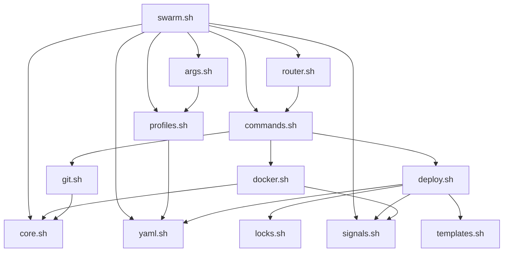

# CLI Modules

SwarmCLI modules reference for developers.

## Architecture

```
bin/
├── swarm.sh              # Entry point
└── lib/
    ├── core.sh           # Core: logging, retry
    ├── args.sh            # Argument parsing
    ├── router.sh          # Command routing
    ├── profiles.sh        # Profile operations
    ├── yaml.sh            # YAML parser
    ├── signals.sh         # Graceful shutdown
    ├── git.sh             # Git operations
    ├── docker.sh          # Docker build/prune
    ├── deploy.sh          # Deploy, rollback
    ├── locks.sh           # Locks
    ├── secrets.sh         # Secrets
    ├── commands.sh        # CLI commands
    ├── validation.sh      # Validation
    ├── generator.sh       # Stack generation
    ├── plugins.sh         # Plugins
    ├── registry.sh       # Service registry
    ├── wizard.sh          # Interactive wizard
    ├── dependencies.sh    # Dependency check
    ├── templates.sh       # Bash wrapper for Jinja2 templating
    └── templates.py      # Jinja2 templating (Python)
```

## Modules

### core.sh

**Size:** ~260 lines

**Functions:**
- `log` — logging
- `fail` — error with exit
- `with_spinner` — animated spinner
- `retry_with_backoff` — retry with exponential backoff
- `safe_load_env` — safe .env loading

### profiles.sh

**Size:** ~400 lines

**Functions:**
- `load_profile` — load profile
- `list_profiles` — list profiles
- `profile_exists` — check existence
- `get_profile_config` — get value from config.yaml
- `save_default_profile` — save default profile
- `load_default_profile` — load default profile
- `cmd_use` — profile management command

### args.sh

**Size:** ~120 lines

**Functions:**
- `parse_global_args` — parse global flags
- `resolve_and_load_profile` — resolve and load profile

### router.sh

**Size:** ~260 lines

**Functions:**
- `resolve_command_alias` — command aliases (d→deploy, b→build)
- `show_help` — display help
- `select_stack_interactive` — interactive stack selection
- `route_command` — main command router

### yaml.sh

**Size:** ~750 lines

**Description:** Built-in Bash YAML parser (requires Bash 4.0+). jq required for JSON output.

**Functions:**
- `yaml_get` — get value
- `yaml_get_keys` — get keys
- `get_services_list` — service list
- `get_service_field` — service field
- `iter_variables_yaml` — iterate over variables.yaml

### signals.sh

**Size:** ~320 lines

**Description:** Graceful shutdown and signal handling module. Solves: zombie processes after Ctrl+C, stuck builds, incomplete cleanup.

**Configuration:**
```bash
GRACEFUL_SHUTDOWN_TIMEOUT=10  # Wait before SIGKILL (sec)
SIGNAL_DEBUG=1                # Signal handling debug
```

**Functions:**
- `init_signal_handlers` — initialize INT/TERM handlers
- `register_child_pid` — register child process for termination
- `unregister_child_pid` — unregister
- `register_cleanup_handler` — register cleanup function
- `set_operation_context` — set operation context (for logs)
- `run_tracked` — run command with tracking
- `run_with_graceful_timeout` — run with timeout and graceful shutdown
- `run_docker_build_tracked` — docker build with timeout

**Shutdown order:**
1. SIGTERM to all child processes
2. Wait `GRACEFUL_SHUTDOWN_TIMEOUT` seconds
3. SIGKILL to remaining processes
4. Run cleanup handlers (LIFO)
5. Exit with appropriate code

### git.sh

**Size:** ~150 lines

**Functions:**
- `sync_repo_for_service` — clone/update repo
- `get_service_commit_sha` — get SHA
- `get_service_current_branch` — current branch

### docker.sh

**Size:** ~200 lines

**Functions:**
- `build_for_service` — build image
- `smart_prune_stack_images` — clean old images
- `get_service_replicas_status` — replica status

### deploy.sh

**Size:** ~770 lines

**Functions:**
- `save_deploy_checkpoint` — save checkpoint
- `save_deploy_history` — save history
- `rollback_deploy` — rollback
- `run_hook` — run hook
- `export_service_tags` — export TAG_*
- `generate_compose_with_resources` — generate compose with resources
- `wait_for_services_ready` — wait for readiness
- `validate_deploy_prerequisites` — validation

### locks.sh

**Size:** ~80 lines

**Functions:**
- `acquire_deploy_lock` — acquire lock
- `release_deploy_lock` — release
- `list_active_locks` — list active
- `force_release_deploy_lock` — force release

### secrets.sh

**Size:** ~150 lines

**Functions:**
- `secrets_sync` — sync secrets
- `check_required_secrets` — check required
- `secret_exists` — check existence
- `cmd_secret_create` — create secret

### commands.sh

**Size:** ~400 lines

**Functions:**
- `cmd_deploy` — deploy
- `cmd_build` — build
- `cmd_rollback` — rollback
- `cmd_repos_sync` — repo sync
- `get_changed_stacks` — changed stacks

### validation.sh

**Size:** ~100 lines

**Functions:**
- `validate_services_yaml` — validate services.yaml
- `validate_service_branches` — validate service branches
- `validate_service_references` — validate SERVICE_*

## Module Dependencies



## Adding a New Module

1. Create file in `bin/lib/`:

```bash
#!/usr/bin/env bash
# my_module.sh - Description

my_function() {
  local arg="$1"
  # ...
}
```

2. Include in `swarm.sh`:

```bash
. "$LIB_DIR/my_module.sh"
```

## Conventions

### Bash

- Local variables: `local var="value"`
- Functions: `function_name() { ... }`
- Checks: `[ -f "$file" ]`
- Errors: `fail "message"`

### Naming

- Functions: `lower_snake_case`
- Variables: `UPPER_SNAKE_CASE`
- Commands: `cmd_<name>`

## See also

- [tech-stack.md](../../_ai/tech-stack.md) — tech stack
