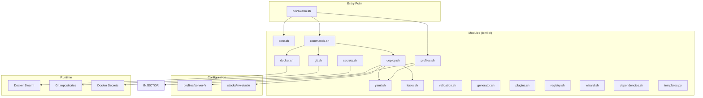
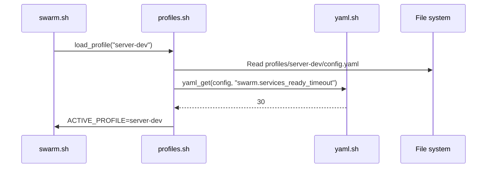
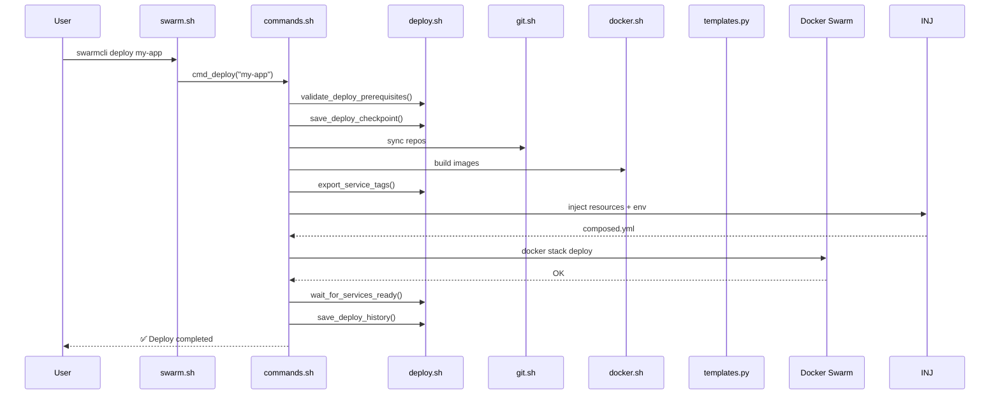

# SwarmCLI Architecture

Overview of the CLI tool architecture for managing Docker Swarm deploys.

## General Diagram



## Key Principles

### 1. Modular Architecture

SwarmCLI is built on modular architecture with clear responsibility boundaries:

| Layer | Components | Responsibility |
|-------|-------------|-----------------|
| **Entry** | `swarm.sh` | Argument parsing, command routing |
| **Commands** | `commands.sh` | CLI command logic |
| **Operations** | `deploy.sh`, `git.sh`, `docker.sh` | Infrastructure operations |
| **Infrastructure** | `locks.sh`, `secrets.sh` | Low-level operations |
| **Core** | `core.sh`, `yaml.sh`, `profiles.sh` | Base utilities |

### 2. Profile Isolation

Each server (dev, prod, db) has an isolated profile:

```
profiles/
├── server-dev/          # Development server
│   ├── config.yaml      # Profile settings
│   └── stacks/          # Profile stacks
├── server-prod/         # Production server
│   ├── config.yaml
│   └── stacks/
└── server-db/           # Database server
    ├── config.yaml
    └── stacks/
```

**Benefits:**
- Full environment isolation
- Different resources for dev/prod
- Different variables and secrets
- Management from single codebase

### 3. Minimal Dependencies

Core is written in Bash 4.0+ with minimal external dependencies:

- Requires only Bash 4.0+, Docker, Git
- Built-in YAML parser (no `yq`); jq required for safe JSON output
- Python only for complex operations (resource injection)

### 4. Declarative Configuration

Configuration is described in YAML files:

```yaml
# services.yaml — stack services
services:
  api:
    type: git
    repo: git@github.com:org/api.git
    
# variables.yaml — variables
runtime:
  env:
    LOG_LEVEL: info
  
# resources.yaml — CPU/Memory resources
stacks:
  my-stack:
    api:
      limits:
        memory: "2G"
```

## System Components

### Entry Point (swarm.sh)

The main CLI script performs:

1. **Initialization** — export paths, load variables
2. **Flag parsing** — `--profile`, `--json`, `--dry-run`, etc.
3. **Profile loading** — from argument, saved default or `$SWARM_PROFILE`
4. **Command routing** — route to appropriate handler

```bash
# Example routing
case "$COMMAND" in
  deploy) cmd_deploy "$@" ;;
  build)  cmd_build "$@" ;;
  ps)     cmd_status "$@" ;;
  # ...
esac
```

### Library Modules (bin/lib/)

Each module has a clear responsibility area:

| Module | Purpose | Key Functions |
|--------|---------|---------------|
| `core.sh` | Logging, retry, utilities | `log`, `fail`, `retry_with_backoff` |
| `profiles.sh` | Profile management | `load_profile`, `list_profiles` |
| `yaml.sh` | YAML parsing | `yaml_get`, `get_services_list` |
| `git.sh` | Git operations | `sync_repo_for_service` |
| `docker.sh` | Docker build/push | `build_for_service` |
| `deploy.sh` | Deploy and rollback | `deploy_stack`, `rollback_deploy` |
| `locks.sh` | Locks | `acquire_deploy_lock` |
| `secrets.sh` | Secrets | `secrets_sync` |
| `templates.py` | Jinja2 templating | Python script |

### Profiles

Profile contains full configuration for a server:

```
profiles/server-dev/
├── config.yaml           # Profile settings
└── stacks/
    ├── globals.yaml      # Global variables
    ├── resources.yaml    # CPU/Memory resources
    └── my-stack/
        ├── docker-stack.yml
        ├── services.yaml
        ├── variables.yaml
        ├── externals.yaml
        ├── settings.yaml
        └── hooks/
```

### Stacks

Stack is a deploy unit containing one or more services:

```yaml
# services.yaml
services:
  api:
    type: git
    repo: git@github.com:org/api.git
    default_branch: develop
    build:
      context: .
      dockerfile: Dockerfile
    image: local/api
    meta:
      group: backend
      
  redis:
    type: registry
    image: redis:7-alpine
```

## Data Flows

### Configuration Loading



### Deploy Process



## Extensibility

### Plugins

SwarmCLI supports a plugin system:

```bash
plugins/
└── swarm-example      # Executable script

# Invocation
swarmcli plugin swarm-example
# or
swarmcli swarm-example   # If command not recognized
```

### Hooks

Each stack can have pre/post deploy hooks:

```bash
hooks/
├── pre-deploy.sh      # Before deploy
└── post-deploy.sh     # After successful deploy
```

Variables available in hooks:
- `$STACK` — stack name
- `$SWARM_PROFILE` — active profile
- `$TAG_*` — image tags
- `$GLOBAL_*` — global variables
- `$DEPLOY_*` — deploy variables

## Security

### Locks

Atomic mkdir locks prevent parallel deploys:

```bash
.locks/
└── deploy_my-app/     # Directory lock
```

### Secrets

- Secret files in `.secrets/` (gitignore'd)
- Created as Docker Secrets
- Versioning: `secret_v1`, `secret_v2`

### Isolation

- Profiles fully isolated
- No shared resources between environments
- Separate variables per profile

## See also

- [CLI Modules](01-modules.md) — module details
- [Data Flows](02-data-flow.md) — flow diagrams
- [Tech Stack](../_ai/tech-stack.md) — technologies and dependencies
