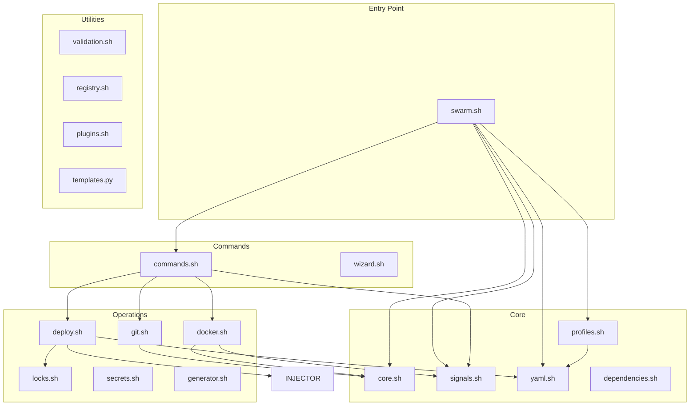

# SwarmCLI Modules

Detailed description of each CLI module.

## Dependency Hierarchy



## core.sh

**Size:** ~310 lines  
**Purpose:** Base utilities, logging, retry

### Functions

#### Logging

```bash
# Simple logging
log info "Starting deployment"
log warn "Deprecated feature"
log error "Something failed"
log ok "Completed successfully"

# Sections for deploy stages
log_section "deploy" "Deploying stack..."
log_section_result "ok" "Deploy completed"

# JSON logging (for automation)
FORCE_JSON=1 log info "message"
# Output: {"ts":"2024-12-21T10:00:00Z","level":"info","msg":"message"}
```

#### Error Handling

```bash
# Exit with error
fail "Critical error occurred"

# Accumulate errors for JSON
add_error "Validation failed"
add_error "Missing config"
# On output: {"errors":["Validation failed","Missing config"]}
```

#### Retry with Backoff

```bash
# Automatic retries with exponential backoff
retry_with_backoff docker build -t myapp .

# Configure via environment variables
RETRY_MAX_ATTEMPTS=5      # Max attempts (default: 3)
RETRY_INITIAL_DELAY=2     # Initial delay (default: 2)
RETRY_MAX_DELAY=30        # Max delay (default: 30)
RETRY_ENABLED=0           # Disable retry
```

#### Spinner

```bash
# Animated spinner for long operations
with_spinner "Building images" docker build -t app .
```

### Variables

| Variable | Description |
|----------|-------------|
| `FORCE_JSON` | JSON output |
| `QUIET` | Quiet mode |
| `VERBOSE` | Verbose mode |
| `NO_COLOR` | Disable colors |
| `DRY_RUN` | Preview without execution |

## signals.sh

**Size:** ~250 lines  
**Purpose:** Graceful shutdown and signal handling

### Problem

When interrupting (Ctrl+C) long operations, child processes (docker build, git clone) continued running in background. Locks and temp files were not released.

### Solution

Module tracks child processes and terminates them correctly on interrupt.

### Functions

```bash
# Initialize signal handlers
init_signal_handlers

# Track child processes
register_child_pid "$pid"
unregister_child_pid "$pid"

# Cleanup handlers
register_cleanup_handler "release_deploy_lock '\$stack'"

# Operation context (for informative logs)
set_operation_context "deploy my-stack"
clear_operation_context

# Run with timeout
run_with_graceful_timeout 900 docker build ...
```

### Behavior on Ctrl+C

```
^C
2024-12-22T10:00:00Z [warn] interrupted during: deploy my-stack
2024-12-22T10:00:00Z [info] sending SIGTERM to PID 12345
2024-12-22T10:00:01Z [info] released deployment lock for my-stack
```

### Variables

| Variable | Default | Description |
|----------|---------|-------------|
| `BUILD_TIMEOUT` | 900 | Docker build timeout (sec) |
| `GRACEFUL_SHUTDOWN_TIMEOUT` | 10 | Wait before SIGKILL (sec) |
| `SIGNAL_DEBUG` | 0 | Debug output |

## profiles.sh

**Size:** ~100 lines  
**Purpose:** Profile loading and management

### Functions

```bash
# Load profile
load_profile "server-dev"

# List all profiles
list_profiles

# Check existence
profile_exists "server-dev"

# Get value from config.yaml
get_profile_config "swarm.services_ready_timeout"
```

### Exported Variables

After `load_profile`:

| Variable | Example | Description |
|----------|---------|-------------|
| `ACTIVE_PROFILE` | `server-dev` | Profile name |
| `PROFILE_DIR` | `/path/profiles/server-dev` | Profile directory |
| `PROFILE_STACKS_DIR` | `/path/profiles/server-dev/stacks` | Stacks directory |

## yaml.sh

**Size:** ~200-300 lines  
**Purpose:** Bash wrapper for PyYAML parser

### Features

- Uses PyYAML via Python script `yaml_parser.py`
- Reliable parsing for key-value structures, anchors/aliases, and nested mappings
- Function API unchanged for backward compatibility
- Python already required for Jinja2, so PyYAML adds no new dependencies

### Functions

```bash
# Get value by path
yaml_get "config.yaml" "swarm.timeout"

# Get section keys
yaml_get_keys "services.yaml" "services"

# Stack service list
get_services_list "my-stack"

# Service field
get_service_field "my-stack" "api" "image"
get_service_field "my-stack" "api" "build.context"

# Iterate over variables
iter_variables_yaml "my-stack" "deploy"
# Outputs: KEY=value on each line
```

### Limitations

- Focused on key-value and nested mapping structures
- Arrays — limited support (no complex nested arrays)

## git.sh

**Size:** ~150 lines  
**Purpose:** Git operations for services

### Functions

```bash
# Sync service repository
sync_repo_for_service "my-stack" "api"
# - Clones if not exists
# - Does fetch + checkout

# Get short SHA of current commit
get_service_commit_sha "api"
# Outputs: abc1234

# Current branch
get_service_current_branch "api"
# Outputs: develop
```

### Variables

| Variable | Description |
|----------|-------------|
| `GIT_HTTP_TOKEN` | Token for HTTP auth |

> **Note:** Variable `REPOS_ROOT` is not used. Use `get_service_repo_dir(stack, service)` to get repository path.

## docker.sh

**Size:** ~200 lines  
**Purpose:** Docker build, push, prune

### Functions

```bash
# Build service image
build_for_service "my-stack" "api"

# Clean old images
smart_prune_stack_images "my-stack"

# Service replica status
get_service_replicas_status "my-stack_api"
# Outputs: 2/2

# Check service existence
service_exists "my-stack_api"
```

### Variables

| Variable | Description |
|----------|-------------|
| `KEEP_IMAGES_COUNT` | How many images to keep (default: 10) |
| `NO_CACHE` | Disable Docker cache |
| `FORCE_REBUILD` | Force rebuild |

### BuildKit

BuildKit is automatically enabled:

```bash
export DOCKER_BUILDKIT=1
export BUILDKIT_PROGRESS=plain
```

## deploy.sh

**Size:** ~780 lines  
**Purpose:** Deploy, rollback, hooks, resources

### Main Functions

```bash
# Save checkpoint for rollback
save_deploy_checkpoint "my-stack"

# Save deploy history
save_deploy_history "my-stack" "success"

# Rollback to previous version
rollback_deploy "my-stack"
rollback_deploy "my-stack" --to-version 2

# Run hook
run_hook "hooks/pre-deploy.sh" "my-stack"

# Export TAG variables
export_service_tags "my-stack"
# Sets: TAG_API=server-dev-abc1234

# Generate compose with resources
generate_compose_with_resources "my-stack" "/tmp/composed.yml"

# Wait for service readiness
wait_for_services_ready "my-stack" 30

# Pre-deploy validation
validate_deploy_prerequisites "my-stack"
```

### Deploy History

```bash
# History stored inside each stack:
profiles/server-dev/stacks/my-stack/.deploy/
├── checkpoint.json   # Snapshot before deploy
└── history.jsonl     # Deploy history
```

History format (JSONL):

```json
{"timestamp":"2024-12-21T10:00:00Z","profile":"server-dev","status":"success","services":[...]}
```

## locks.sh

**Size:** ~80 lines  
**Purpose:** Atomic deploy locks

### Functions

```bash
# Acquire lock
acquire_deploy_lock "my-stack"

# Release
release_deploy_lock "my-stack"

# List active locks
list_active_locks

# Force release
force_release_deploy_lock "my-stack"

# Clean stale
cleanup_stale_locks
```

### Mechanism

Locks implemented via atomic `mkdir`:

```bash
.locks/
└── deploy_my-stack/
```

If directory exists — lock is held.

## secrets.sh

**Size:** ~150 lines  
**Purpose:** Docker Secrets

### Functions

```bash
# Sync secrets
secrets_sync

# Check required secrets
check_required_secrets "my-stack"

# Check existence
secret_exists "pg_password"

# Create secret
cmd_secret_create "pg_password"

# Remove secret
cmd_secret_rm "pg_password"

# Generate random
cmd_secret_generate "jwt_secret" --length 64
```

### Secret Files

> **Important:** Secrets are stored in the global `.secrets/` directory at swarmcli root.

```bash
.secrets/
├── pg_password.txt
├── jwt_private_key.pem
└── ...
```

## commands.sh

**Size:** ~400 lines  
**Purpose:** CLI command handlers

### Commands

| Function | Command | Description |
|----------|---------|-------------|
| `cmd_deploy` | `deploy` | Deploy stack |
| `cmd_build` | `build` | Build images |
| `cmd_rollback` | `rollback` | Rollback |
| `cmd_repos_sync` | `pull` | Sync repos |
| `cmd_list` | `ls` | List stacks |
| `cmd_status` | `ps` | Service status |
| `cmd_validate` | `check` | Validation |
| `cmd_diff` | `diff` | Changed stacks |
| `cmd_apply` | `apply` | Apply changes |

## validation.sh

**Size:** ~100 lines  
**Purpose:** Configuration validation

### Functions

```bash
# Validate services.yaml
validate_services_yaml "my-stack"

# Validate branches (deprecated)
validate_service_branches "my-stack"

# Validate SERVICE_* references
validate_service_references "my-stack"
```

## templates.py

**Size:** ~1100 lines  
**Language:** Python 3  
**Purpose:** Jinja2 templating of docker-stack with resource injection, variables, Dozzle labels

### Functionality

1. **CPU/Memory Resources**
   - Reads `resources.yaml`
   - `deploy_resources()` function in templates

2. **Environment Variables**
   - `inject_env_vars()` function in templates
   - Auto-injection via YAML anchors

3. **Dozzle Labels**
   - Reads `meta` from `services.yaml`
   - `dozzle_labels()` function in templates

### Usage

```bash
swarmcli template render my-stack
swarmcli template vars my-stack
```

## Other Modules

### generator.sh (~200 lines)

Generation of new stacks and services.

### plugins.sh (~80 lines)

Plugin system:

```bash
list_plugins
plugin_exists "my-plugin"
execute_plugin "my-plugin" arg1 arg2
```

### registry.sh (~100 lines)

Service registry for `SERVICE_*` references:

```bash
cmd_registry_list
cmd_registry_validate
```

### wizard.sh (~150 lines)

Interactive creation wizard:

```bash
cmd_create  # Start wizard
```

### dependencies.sh (~50 lines)

System dependency check:

```bash
cmd_check_deps
# Checks: docker, git, bash version
```

## Code Conventions

### Naming

| Type | Style | Example |
|------|-------|---------|
| Functions | `lower_snake_case` | `load_profile` |
| Variables | `UPPER_SNAKE_CASE` | `ACTIVE_PROFILE` |
| CLI commands | `cmd_<name>` | `cmd_deploy` |
| Local | `local` | `local stack="$1"` |

### Function Structure

```bash
# Function description
# Usage: function_name <required> [optional]
# Returns: return description
function_name() {
  local required="$1"
  local optional="${2:-default}"
  
  # Logic
  
  return 0
}
```

### Error Handling

```bash
# Critical error — exit
fail "message"

# Accumulate errors
add_error "message"
return 1

# Warning
log warn "message"
```

## See also

- [Data Flows](02-data-flow.md) — flow diagrams
- [Architecture Overview](00-overview.md) — general overview
