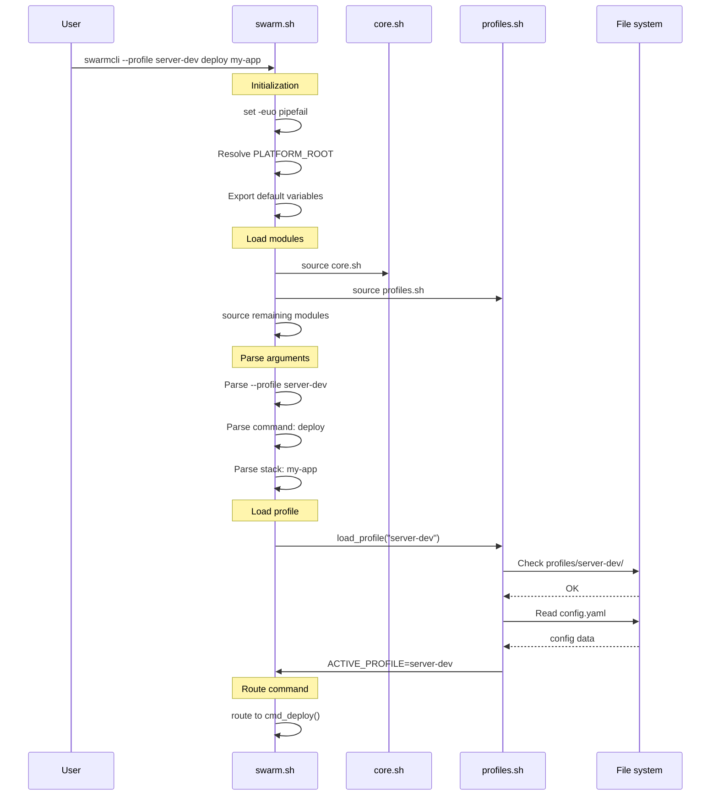
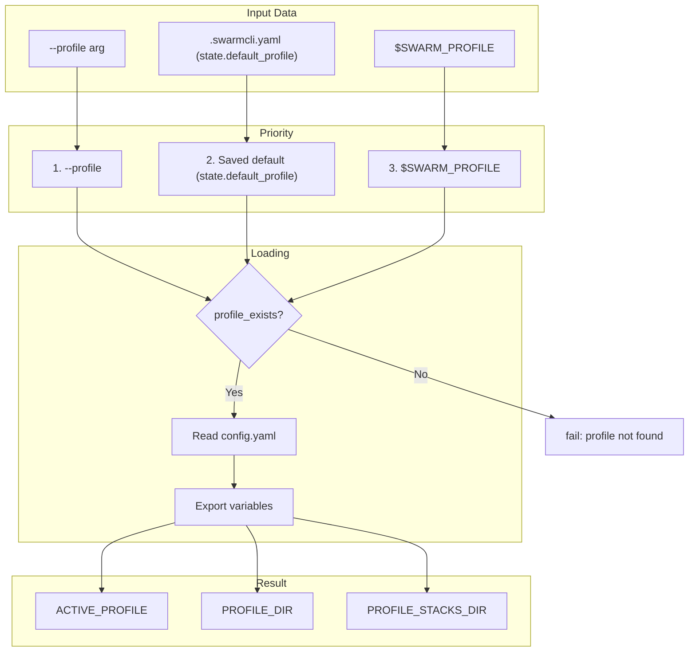
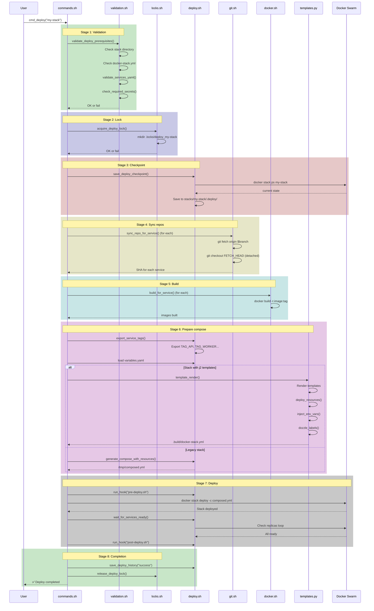
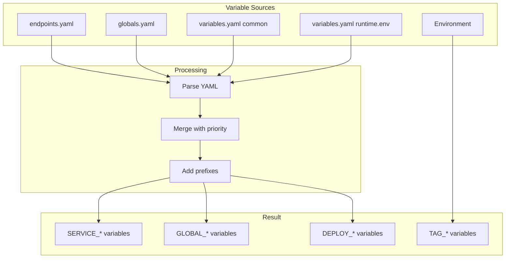
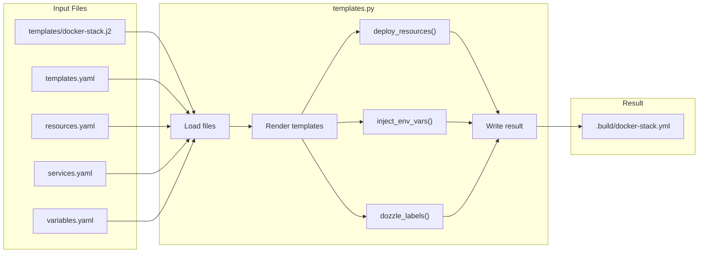
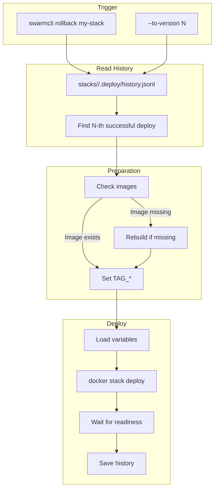
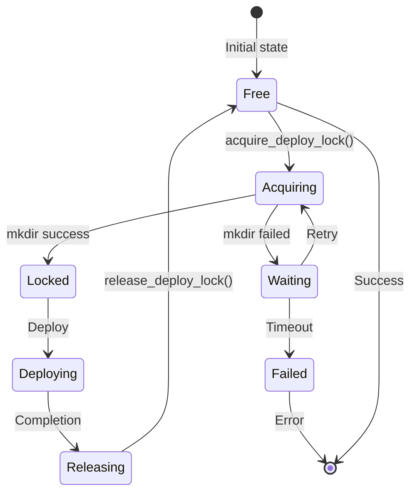
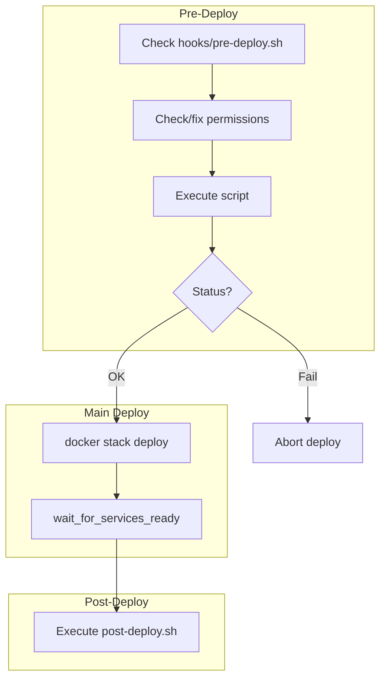
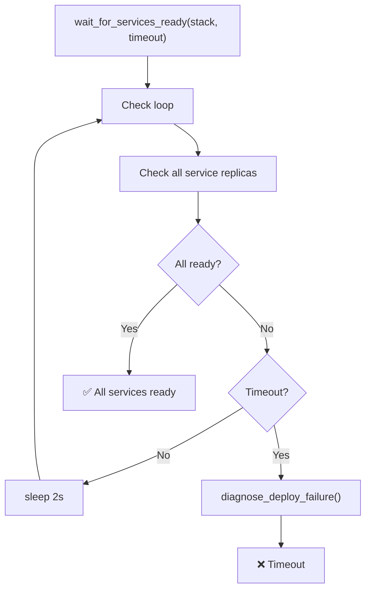

# Data Flows

Detailed data flow diagrams in SwarmCLI.

## CLI Initialization



## Profile Loading



## Deploy Process (Detailed)



## Variable Loading



**Priority order (lowest to highest):**

1. `endpoints.yaml` → `SERVICE_*`
2. `globals.yaml` → `GLOBAL_*`
3. `variables.yaml` (common) → variables
4. `variables.yaml` (runtime.env) → environment
5. Environment → overrides all

## Resource Injection



**What gets injected:**

```yaml
# Before injection
services:
  api:
    image: local/api:${TAG_API}

# After injection
services:
  api:
    image: local/api:${TAG_API}
    environment:
      - LOG_LEVEL=${LOG_LEVEL}
    deploy:
      resources:
        limits:
          cpus: "2.0"
          memory: "2G"
      labels:
        dev.dozzle.group: backend
        dev.dozzle.name: API Service
```

## Rollback



## Lock System



**Mechanism:**

```bash
# Acquire (atomic mkdir)
mkdir .locks/deploy_my-stack 2>/dev/null

# Release
rmdir .locks/deploy_my-stack

# Timeout: LOCK_TIMEOUT seconds (default: 3600)
```

## Hooks



**Variables available in hooks:**

```bash
$STACK           # Stack name
$SWARM_PROFILE   # Active profile
$TAG_API         # API image tag
$TAG_WORKER      # Worker image tag
$GLOBAL_TZ       # Global variable TZ
$DEPLOY_LOG_LEVEL # Deploy variable
```

## Readiness Wait



**Diagnostics on failure:**

```
╔══════════════════════════════════════════════════════════════════════════════╗
║              DEPLOYMENT FAILURE DIAGNOSTICS                                  ║
╚══════════════════════════════════════════════════════════════════════════════╝

Stack: my-stack
Failed services: 1

my-stack_api: 0/2
  Tasks:
    - State: Failed, Error: "image not found"
    
  Recent logs:
    Error: Cannot pull image...

╔══════════════════════════════════════════════════════════════════════════════╗
║                        TROUBLESHOOTING HINTS                                 ║
╚══════════════════════════════════════════════════════════════════════════════╝

1. Check task errors: docker service ps my-stack_api --no-trunc
2. View service logs: docker service logs my-stack_api --tail 50
```

## See also

- [Architecture Overview](00-overview.md)
- [Modules](01-modules.md)
- [Deploy Process](../01-concepts/06-deploy-flow.md)
