# Deploy Failures

Detailed guide for diagnosing and resolving deploy issues.

## Deploy Stages and Possible Issues

```mermaid
flowchart TB
    subgraph Stage1["1. Validation"]
        V1[Stack check]
        V2[services.yaml check]
        V3[Secrets check]
    end
    
    subgraph Stage2["2. Lock"]
        L1[Acquire lock]
    end
    
    subgraph Stage3["3. Git"]
        G1[Clone/Fetch]
        G2[Checkout branch]
    end
    
    subgraph Stage4["4. Build"]
        B1[Docker build]
        B2[Push to registry]
    end
    
    subgraph Stage5["5. Deploy"]
        D1[Export TAGs]
        D2[Pre-deploy hook]
        D3[docker stack deploy]
        D4[Wait for ready]
        D5[Post-deploy hook]
    end
    
    V1 -->|Error| E1[Stack not found]
    V2 -->|Error| E2[Invalid config]
    V3 -->|Error| E3[Missing secrets]
    
    L1 -->|Error| E4[Lock busy]
    
    G1 -->|Error| E5[Git auth failed]
    G2 -->|Error| E6[Branch not found]
    
    B1 -->|Error| E7[Build failed]
    B2 -->|Error| E8[Push failed]
    
    D3 -->|Error| E9[Deploy failed]
    D4 -->|Error| E10[Services not ready]
```



## Stage 1: Validation

### Error: "stack directory not found"

**Diagnostics:**

```bash
ls -la profiles/server-dev/stacks/
swarmcli check my-stack
```

**Causes:**

1. Typo in stack name
2. Stack not created
3. Wrong profile

**Solution:**

```bash
# Check stack list
swarmcli ls

# Create stack
swarmcli create
# Select "Stack" → Enter name
```

### Error: "docker-stack.yml not found"

**Cause:** compose file missing.

**Solution:**

```bash
# Create basic docker-stack.yml
cat > profiles/server-dev/stacks/my-stack/docker-stack.yml << 'EOF'
services:
  api:
    image: local/api:${TAG_API}
    deploy:
      replicas: 1

networks:
  default:
    driver: overlay
    attachable: true
EOF
```

### Error: "validation failed: services.yaml"

**Diagnostics:**

```bash
swarmcli check my-stack --verbose
```

**Typical issues:**

```yaml
# ❌ Wrong: type missing
services:
  api:
    repo: git@github.com:org/api.git

# ✅ Correct
services:
  api:
    type: git
    repo: git@github.com:org/api.git
```

### Error: "required secret not found"

**Diagnostics:**

```bash
# Check required secrets
cat profiles/server-dev/stacks/my-stack/externals.yaml

# Check existing
docker secret ls

# Check via CLI
swarmcli secret check my-stack
```

**Solution:**

```bash
# Create missing secret
swarmcli secret create my_secret

# Or sync all
swarmcli secret sync
```

## Stage 2: Lock

### Error: "cannot acquire deployment lock"

**Diagnostics:**

```bash
# Check active locks
swarmcli lock ls

# Check lock directory
ls -la /opt/swarmcli/.locks/
```

**Causes:**

1. Another deploy in progress
2. Stuck lock after failure
3. Parallel CI/CD pipeline

**Solution:**

```bash
# Wait for other deploy to finish
# or

# Clean stale locks (older than 1 hour)
swarmcli lock prune

# Force remove (careful!)
swarmcli lock rm my-stack
```

## Stage 3: Git

### Error: "Permission denied (publickey)"

**Diagnostics:**

```bash
# Check SSH key
ssh -T git@github.com

# Check ssh-agent
ssh-add -l
```

**Solution:**

```bash
# Add key to agent
eval "$(ssh-agent -s)"
ssh-add ~/.ssh/id_ed25519

# For CI/CD — configure SSH_PRIVATE_KEY
```

### Error: "branch not found"

**Diagnostics:**

```bash
cd /opt/swarmcli/repos/api
git branch -a
```

**Causes:**

1. Branch doesn't exist in remote
2. Fetch not done
3. Typo in branch name

**Solution:**

```bash
# Update remote
cd /opt/swarmcli/repos/api
git fetch --all --prune

# Check available branches
git branch -a | grep feature
```

### Error: "repository not synced"

**Diagnostics:**

```bash
ls -la /opt/swarmcli/repos/
```

**Solution:**

```bash
# Sync repositories
swarmcli sync my-stack

# Or clone manually
cd /opt/swarmcli/repos
git clone git@github.com:org/api.git api
```

## Stage 4: Build

### Error: "build failed"

**Diagnostics:**

```bash
# Build with verbose
swarmcli build my-stack --verbose

# Build manually
cd /opt/swarmcli/repos/api
docker build -t test:latest .
```

**Typical causes:**

1. **Dockerfile error**

   ```bash
   # Check Dockerfile
   cat Dockerfile
   docker build -t test . 2>&1 | head -50
   ```

2. **Dependencies unavailable**

   ```bash
   # Check network
   docker run --rm alpine ping -c 3 registry.npmjs.org
   ```

3. **No disk space**

   ```bash
   df -h
   docker system df
   docker system prune -a
   ```

### Error: "no space left on device"

**Solution:**

```bash
# Clean Docker
docker system prune -a --volumes

# Clean old stack images
docker images | grep my-stack | awk '{print $3}' | xargs docker rmi -f

# Use --prune on deploy
swarmcli deploy my-stack --prune
```

### Error: "failed to pull base image"

**Causes:**

1. Docker Hub rate limit
2. Private registry unavailable
3. Network issues

**Solution:**

```bash
# Login to Docker Hub
docker login

# For private registry
docker login registry.example.com

# Check availability
docker pull alpine:latest
```

## Stage 5: Deploy

### Error: "timeout waiting for services"

**Diagnostics:**

```bash
# Service status
docker service ls | grep my-stack

# Task details
docker service ps my-stack_api --no-trunc

# Logs
docker service logs my-stack_api --tail 50
```

**Typical causes and solutions:**

#### 1. Container crash (exit code ≠ 0)

```bash
# Check exit code
docker service ps my-stack_api --no-trunc

# Logs for cause
docker service logs my-stack_api --tail 100
```

**Typical exit codes:**

| Code | Meaning | Solution |
|------|---------|----------|
| 1 | General application error | Check logs |
| 137 | OOMKilled | Increase memory limit |
| 139 | Segfault | Code issue |
| 143 | SIGTERM | Graceful shutdown timeout |

#### 2. Health check failing

```yaml
# docker-stack.yml
healthcheck:
  test: ["CMD", "curl", "-f", "http://localhost:8080/health"]
  interval: 30s
  timeout: 10s
  retries: 3
  start_period: 60s  # Give time to start
```

#### 3. Insufficient resources

```bash
# Check constraints
docker service inspect my-stack_api --format '{{.Spec.TaskTemplate.Placement.Constraints}}'

# Check available nodes
docker node ls
```

#### 4. Volume/mount issues

```bash
# Check volumes
docker service inspect my-stack_api --format '{{json .Spec.TaskTemplate.ContainerSpec.Mounts}}' | jq

# Check path exists
ls -la /path/to/volume
```

#### 5. One-shot init services (Superset, migrations)

**Symptom:** `superset_init` or similar init job runs, completes successfully, exits — deploy fails with "services not ready" because Swarm shows 0/1 (task completed, not running).

**Solution:** Exclude one-shot services from readiness check in `settings.yaml`:

```yaml
# settings.yaml
readiness_exclude:
  - superset_init
```

### Error: "image not found"

**Cause:** image not built or lost.

**Solution:**

```bash
# Check images
docker images | grep my-stack

# Rebuild
swarmcli build my-stack --force

# Deploy with rebuild
swarmcli deploy my-stack --force
```

### Error: "network not found"

**Solution:**

```bash
# Create network
docker network create --driver overlay --attachable my-network

# Or add to docker-stack.yml
networks:
  my-network:
    driver: overlay
    attachable: true
```

### Error: "secret not found"

```bash
# Check secrets
docker secret ls

# Create
swarmcli secret sync
```

## Readiness Diagnostics

SwarmCLI shows automatic diagnostics on timeout:

```
╔══════════════════════════════════════════════════════════════════════════════╗
║              DEPLOYMENT FAILURE DIAGNOSTICS                                  ║
╚══════════════════════════════════════════════════════════════════════════════╝

Stack: my-stack
Failed services: 1

── my-stack_api ──
  Replicas: 0/2
  
  Task Status:
    ├─ Task 1: Failed - "starting container failed: OCI runtime error"
    └─ Task 2: Pending - "no suitable node"
    
  Recent Logs (last 30 lines):
    Error: Cannot connect to database
    Connection refused: postgres:5432
    
╔══════════════════════════════════════════════════════════════════════════════╗
║                        TROUBLESHOOTING HINTS                                 ║
╚══════════════════════════════════════════════════════════════════════════════╝

1. Check task errors: docker service ps my-stack_api --no-trunc
2. View service logs: docker service logs my-stack_api --tail 50
3. Force service update: docker service update --force my-stack_api
4. Test container manually: docker run --rm -it local/api:tag /bin/sh
```

## Rollback on Issues

### Automatic rollback

```bash
swarmcli rollback my-stack
```

### Rollback to specific version

```bash
# View history
cat /opt/swarmcli/profiles/server-dev/stacks/my-stack/.deploy/history.jsonl | tail -5

# Rollback 2 versions back
swarmcli rollback my-stack --to-version 2
```

### Manual rollback

```bash
# Find previous working tag
docker images | grep my-stack

# Update service
docker service update --image local/api:server-dev-abc1234 my-stack_api
```

## Prevention

### 1. Always use --dry-run

```bash
swarmcli deploy my-stack --dry-run
```

### 2. Validate before deploy

```bash
swarmcli check my-stack
```

### 3. Health checks

```yaml
healthcheck:
  test: ["CMD", "wget", "-q", "--spider", "http://localhost:8080/health"]
  interval: 30s
  timeout: 10s
  retries: 3
  start_period: 60s
```

### 4. Graceful shutdown

```yaml
deploy:
  update_config:
    order: start-first
    failure_action: rollback
  rollback_config:
    parallelism: 1
stop_grace_period: 30s
```

### 5. Increase timeout for heavy applications

```yaml
# settings.yaml
services_ready_timeout: 120
```

## See also

- [Common issues](00-common-issues.md)
- [Deploy process](../../01-concepts/06-deploy-flow.md)
- [CI/CD Troubleshooting](../gitlab-ci/00-overview.md#troubleshooting)
